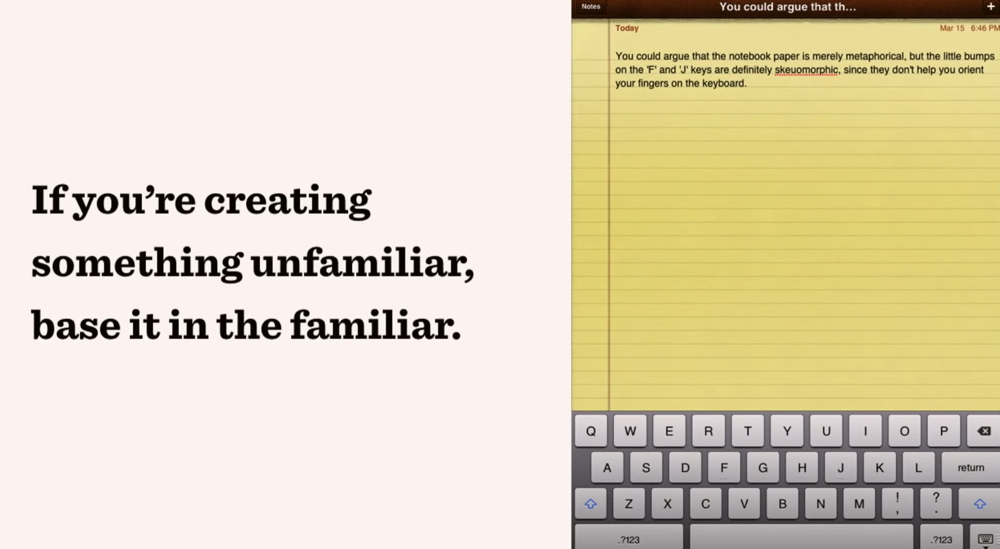
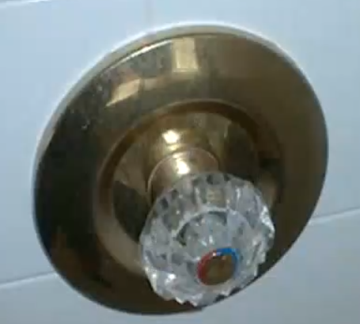
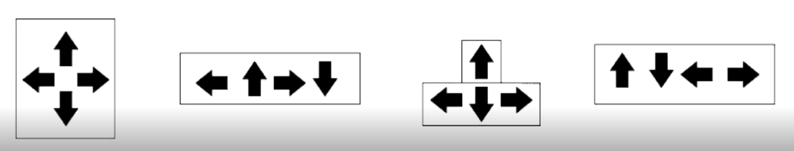

# 美学与设计心理学第十周上课笔记

上一周结尾讲了Concept Model(Mental Model)的Structural model和 Functional model, 这一周补充了一个例子。

一个UX design(User experience)“颠覆”了人们平常使用的汽车换挡习惯。一般来说，汽车换挡会有明显的“咔咔”声并会有停顿感，但这一款新车“大胆创新”取消了汽车换挡时的听觉、触觉反馈，而采用了视觉反馈————当你挂挡后，这款车的手把会自动回到中间位置，而标志当前挡位的则是手把上的灯光。  
这样的设计是好的设计吗？不走寻常路的设计就一定是好的设计吗？  
这个设计的结果就是，当人们准备下车时，并不意识到shifter也就是换挡的手把并没有调节到泊车挡位(Park)。人们自然地走下车，然后车子开始滑行。这个滑稽的设计最后导致这款车被大量召回，但该车企仍然坚持“驾驶者应该学习这个设计以避免事故”.

在上面这个例子中，人们不习惯变速的新设计是因为汽车发展以来用了五十年的时间发展了驾驶的习惯，对于习惯的认可使得人们自然而然地以为：新的车型也会遵循这个使用的习惯。这就引申出一个概念：**Mental Model**

**Mental Model**的定义是：人们遵循以往习得的知识与获得的经验，在心中形成了外部现实的映射（观念）。或者简单地说，就是你根据以往的经验做判断，认为事情将会怎样发展。
  
设计师要考虑“习惯”对行为的影响，尤其是在做创新设计时。比方说iPad的记事本并一开始就是我们今天看到的这样简洁、明确。  

实现好的创新设计的前提是：你确保新的设计必现有的更好（给用户带来更好的体验），但是不要忘记：由于它是一个新的设计、截然不同的设计，你得教会用户如何使用它，就像iPhone在最初几代会内置iPhone使用教程。

## Visibility

Visibility的含义为设计的显性。假设你的设计让功能并不一目了然，比方说用户不能一眼看出你这个产品该如何使用，或者需要在一大堆的button中浏览，那么就没有好的**设计的可视性**。  
一个例子是浴室的淋浴头，它有两个功能实现需求：冷水还是热水，以及指示出水的方式和水量。  

今天我们生活在一个可以“功能富足”的世界，更多功能的微波炉、更多功能的手机...但是作为设计师，我们要考虑的是用户的使用体验，而不是去“炫耀”产品功能的丰富。十年前的电视遥控上密密麻麻都是按钮，今天我们使用的电视遥控基本只有寥寥数个按钮，这难道是一种退步吗？并不是，而是我们简化了许多功能，让遥控面板更为直观、可操作。

## 设计的布局、匹配？ Mapping

为什么我们要好的布局？阅读性，让产品符合我们在现实世界中常见的习惯。  
  

## Feedback 反馈

我们用自己最熟悉的游戏设计为例子：在游戏分类中有一个独特的分类————动作游戏（如经久不衰的“街霸”系列作品），就是靠着“击打反馈感”吸引玩家。在交互设计领域，一个重要的工作就是研究怎样给予用户准确、有趣的反馈。  

## 格式塔心理学

格式塔心理学的基本解释是：我们认识世界时倾向于认识整体而非部分。  
格式塔心理学由六个 design principles 组成：
+ Figure-ground 图形与背景的区分（许多视觉错误作品利用这一点，如图形和背景的混淆来表现两个objects）
+ Similarity 相似性是利用联想进行的心理学设计  
+ Proximity 邻近元素的整体性。比方说将有关的信息放在同一个区块中让用户阅读。
+ Closure 视觉对封闭性的检查 
+ Continuity 连续的objects会让我们下意识地将它们视为一个整体来理解
+ Order 对称地排布元素会让设计变得有吸引力

"The best designs unintentionally make the world feel a little less chaotic." 

Personal _Information_Hide Personal _Information_Hide