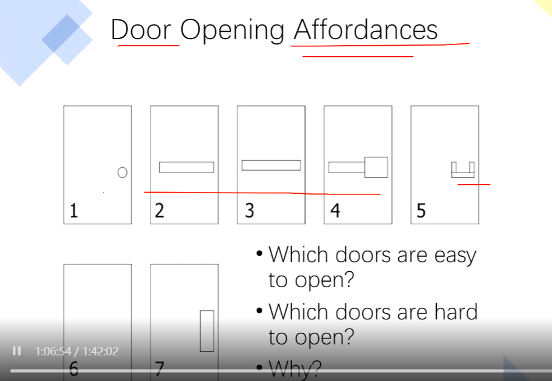
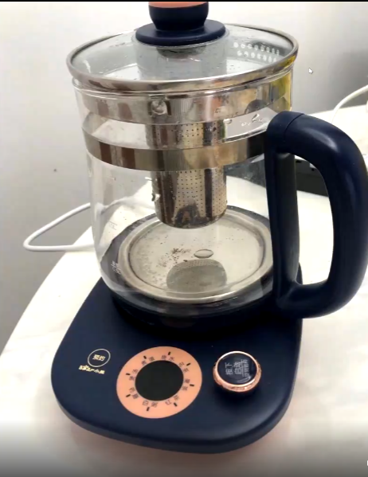

# 第九周设计心理学学习笔记

## 从书中联系实际可以得到的一些设计tips 

**Affordances 用户的承受度**，一个好的例子是早期的门户网站，密密麻麻的链接，让用户难以聚焦。

**用户使用时解释与执行的鸿沟**，以苹果和Thinkpad为例子，工程师具有很强的专业素养，自然会知道电脑该如何精密地使用。但是对于大众用户来说，直观的、直觉的使用流程、操作会大大提升他们的电脑使用体验。

**使用更加自然的排版 (Natural Mapping)**,

**让系统状态视觉化 Make state visible**，让产品的使用方式、使用状态可以一目了然。

**概念模型 Conceptual model 搭建**

**对用户的操作提供反馈**，一个好的例子是许多blogs会设置鼠标点击样式，用户点击鼠标左键时会在鼠标指针处绽放烟花。现在在文字工作者、代码工程师、游戏玩家群体中十分流行的机械键盘，最大的卖点就是提供不同的反馈感，让使用者敲击键盘时获得即时的反馈。

**产品功能的使用频率**，我们的产品真的应该越多功能越好吗？对于大部分人来说，一个具有众多功能、面板上密布按键的家庭影院播放盒子是否远超了用户的实际使用需求？当我们追求有更多功能的手机、智能手表等科技产品时，我们又有效利用了它们的多少效能呢？

### Affordances
椅子的“天职”就是让人坐下、按钮的“天职”就是让人按下...让我们的设计更加符合用户的预期，减少学习-执行之间的差距。
  
注意2、3、4号门，像这类形状的门一般作紧急逃生门，例如我们学校的火警逃生门。很容易发现，在日常实际体验中，这一类门总是向户外侧推开的；这里其实是考虑了紧急情况下人的心理状态——不顾一切地想要往前跑，也只有使用者push了门上的横杆以后门才会单向打开，并自动关闭阻挡火势继续蔓延。  
与现实世界相对的是虚拟世界，虚拟世界中并没有physical objects给用户以affordances. 但是当使用者在虚拟世界中进行界面的交互时，同样会有感知的affordances.   
  
右侧的旋钮文字叙述太复杂，并且旋钮的反馈是中间的挡位变化呈现；旋钮放置在右侧会给拿取水壶本体造成不便。总的来说，一个简单的产品不应该用大段的说明“教”用户怎样使用，更不应该让用户不断地试错后才弄清楚产品的使用流程、使用细节。

### Norman's 2 main principles
+ Provide a good conceptual model （你的设计working flow要符合人的使用习惯、思维方式）
  + People build their own systems of how things work. 人对于世界运行的方式是由基本固定的认知系统的。
  + Designer can help user foster an approprate conceptual model. 设计师可以协助用户更好地适应产品的使用。一个好的例子是没到一个新的酒店，观察卫浴的冷热调整方式，大多使用红、蓝冷暖色来进行视觉、触觉的同感。
+ Make things visible (Affordances is part of this)

### Mental models are not always right
+ 两个层次之表现层 Functional model
  + 这一层是面向用户的
  + 用户需要 stimulus - response 即即时的反馈感
  + 用户发动汽车'Press the accelerator once, then turn the key.'
+ 两个层次之工程层 Structural model
  + 这一层是面向开发者、维护者等工程师、专业技术人员的
  + Deeper sense of why it happens, not just what happens. 作为工程师，需要对整个产品的工作流程、原理有全面、准确的把握
  + 工程师分析汽车启动 'Press the accelerator to engage the automatic choke on a carburetor.'

一个极为重要、现实的问题是在为用户设计产品、服务时没有将 structural model 包装成 functional model. 一个比较清晰的例子是政府门户网站的设计，为了追求架构的稳定（少犯错）而大量地减少了或者干脆不考虑用户的体验性。

