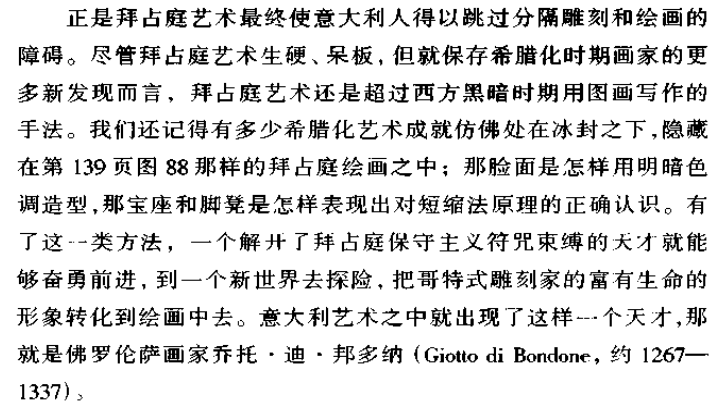
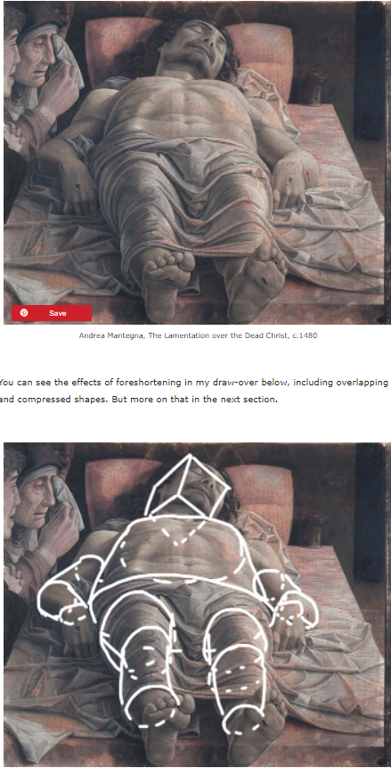
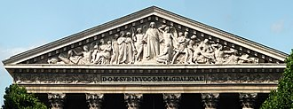
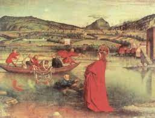

# 艺术的故事 读书摘要（第八章-第十二章）1997年引进版

**主题：西方 中世纪 融合 基督教**

本⽂依据英国作家贡布⾥希的《艺术的故事》第⼋章到第⼗⼆章内容。

## 第八章、第九章和第十章 基督教的战斗与发展、欧洲文化融合
我们⼀般将⻄历五百年左右视为中世纪的开始，这以后是罗⻢帝国崩溃的时期，接踵⽽来的是基督教脱离早期
的形态、开始逐步在欧洲确定教会的权威。教宗额我略⼀世（有时我们也译为格⼒⾼列）⼤⼒推崇使⽤图像向
群众传授圣训，使得宗教艺术成为这⼀时期为后⼈所记住的特征之⼀。

所谓“⿊暗的中世纪”( Dark Ages) 的艺术，其实并没有任何⼀种明确⽽统⼀的⻛格出现。⼀⽅⾯，中世纪是欧
洲⼀个重要的⺠族融合的时期，也是社会出现剧烈的阶层分化的时期。在受⼈尊敬的修道院、修⼥院中的神职
⼈员对古代社会留下的艺术珍宝倍为推崇，试图利⽤他们的影响⼒向宫廷推⼴他们欣赏的各类艺术（与此同时
的是⼤多数⺠众并不直接参与到对艺术的欣赏中）。欧洲南部的政权⼀次⼜⼀次遭受到北⽅的异族的冲击：哥
特⼈、汪达尔⼈、丹⻨⼈…⽽北⽅来的“蛮族”⻚带来他们部落的艺术形式。

⻄⽅的艺术迎来了**融合各类派别**的机会。贡布⾥希在书中举了⼀个例⼦：现藏于British Library的《林迪斯法恩
福⾳书》( Lindisfarne Gospel)在⻄元700年左右创作，它的⼗字架由“缠绕着⻰或蛇构成极为复杂的花边组
成”；⽽在此之前的⼯匠们并不这样设计⼗字架。恰恰是，来⾃北⽅的条顿各部落( Teutonic, 即上述说过的哥
特、汪达尔等等皆属于条顿）喜爱复杂的图案，其中就包括盘绕回旋的⻰体。
不管怎么说，这⼀时期让⻄⽅艺术有了创新的机会。我们必须认识到，⼯匠、艺术家们在设计教堂、圣餐杯或
者绘制宗教故事并不被希望做创新。相反的，委托⼈会要求他们尽可能地模仿“著名的古⽼样板”来说明圣徒的
事迹应该如何正确地加以表现。
以教堂的样式举例：最早最原始的巴⻄利卡式教堂——⼀种古罗⻢的公共建筑形式（源于希腊语“王者之厅”之
意）在罗⻢⻛时代（也译为罗曼式，以半圆拱为特征的建筑⻛格）⼤为流⾏，进⼊中世纪以后在英国，随着诺
曼底⼈在英国登陆，⼀种新的⻛格称为诺曼底⻛格(Nonman Style)或者在欧洲⼤陆称为罗⻢式⻛格
(Romanesque Style)逐渐兴旺，对巴⻄利卡式教堂产⽣影响。
罗⻢式或者说诺曼底式教堂给⼈的印象是坚实有⼒，装饰、窗户都很少，让⼈想到中世纪的堡垒要塞。基督教
的教堂坐落在“刚刚从异教⽣活⽅式转变过来的农⺠、武⼠的⼟地上，**似乎就在表⽩基督教正在战⽃**”。
为了建造罗⻢式教堂，这⼀时期还使⽤⽯头圆拱取代了巴⻄利卡式的⽊制平顶，期间伴随⼤量的建筑技术进
步。
⽽在⼗⼆世纪的法国北部，⼀种新的建造形式即将席卷⼏乎整个欧洲）**哥特式建筑**。哥特式建筑最强烈的特征
之⼀是它的“⻜扶垛（或者叫⻜扶壁）”( fly buttress). 这是⼀种起⽀撑作⽤的建筑结构部件，凌空跨越了下层
的附属空间（例如⾛道）连接到顶部⾼墙⽤于平衡肋架拱顶对墙⾯的侧向推⼒。另外⼀个哥特式建筑的特征是
⾼⾼的中殿（我们⼀般认为这是为了容纳更多的信徒）。总⽽⾔之，哥特式建筑的实现是⼯程学上巨⼤进步的
成绩！但是，设计师在哥特式建筑的流⾏中的作⽤也不容忽视！
我们现在下意识产⽣的教堂内部的影象⼤多是哥特式教堂的：⾼耸的拱顶被侧⾯墙壁的细⻓的柱⼦所连接的编
制的拱肋⽀撑起来；拱顶被⽹状结构的交叉的拱肋覆盖，窗户上的花纹也布满花样的交织线条。是的，这样的
教堂带给信徒们以另⼀个美好的世界的想象——他们在布道的圣歌中听闻的富饶精致的耶路撒冷——就这样出
现在他们所礼拜的教堂。相⽐于先前的宏伟的罗⻢式教堂，哥特式教堂尽管少了强⼒，但也让教堂的不再冰冷
可畏，⽽是华丽、迷幻，满足了宗教信徒们对经书中所允诺的死后升天归宿——天堂的美好想象。

“建筑哥特式教堂的主导思想”：
> 用交叉拱建造教堂拱顶，而一改罗马式教堂采用粗大立柱的办法而使用细长的立柱，在立柱之间建造石头做的填料（而非以前使用的巨大的石壁）。再在外墙上使用细细的“肋”作外墙的支撑。今天我们看到的温室大抵和哥特式教堂的结构相似。哥特式教堂的独特结构使得用巨大的精美的玻璃取代厚重的石墙成为可能，于是那一时期的教堂就成为了哥特式的————**一种人世间从未目睹过的，巨大的、壮观的、精美的，石头和玻璃的建筑物**。

这里需要强调一下所谓的“东方的保守风格”并不是指中国、波斯等东方国度在艺术创作上的保守态度，而是一种欧洲中心主义的（尤其是西欧中心主义的）傲慢。比方说作者在描述13实际的意大利画家的工作时，会说“意大利工匠也是指望君士坦丁堡给予他们灵感和指教，而不是指望巴黎”（在主教堂时代，13世纪，法国是整个欧洲的文化中心）。这里的“君士坦丁堡”其实指的是垂垂老矣的东罗马帝国（象征着古罗马、古希腊的古典文化）。原书中讲到**希腊手法 Greek Manner**，
在互联网上找了一遍只发现一篇可能相关的[论文](https://www.jstor.org/stable/3177253?seq=22)，但是可以从一个采用了 **Greek Manner**的雕塑作品中窥见一斑。
   
[雕塑家是一位17世纪活跃的艺术家](https://en.wikipedia.org/wiki/Fran%C3%A7ois_Duquesnoy)，他的作品被评论家认为是“典雅的罗马美学”.

上图摘自原书。这里要补充的一个话题是：“分隔雕刻和绘画的障碍”指的是什么。这里可能涉及到一些历史地理学的知识：所谓的“蛮族”自北方的海洋、大森林源源不断地南下进入西欧，在征服、统治中完成文化的融合。意大利半岛也曾短暂地建立了北方人征服者的“东哥特王国”，但是在漫长的中世纪里，意大利绝大部分时间都是基督教的重要阵地（可以参考“丕平献土”事件的影响）东罗马帝国不断地对意大利半岛施加影响力以其恢复帝国的往日荣光。而在北方人所带来的艺术中，书中的原话是：**北方绘画已经公开地不以制造真实感为意了**；但是雕塑艺术，无论在北方还是南方，总是更加容易地构建出真实感————因为雕塑作品本身就是空间的，无论是**短缩法**还是**明暗色调造型**，都可以表现出立体感。

[“短缩法” (Foreshortening)](https://drawpaintacademy.com/foreshortening/) 是一种表现空间感的技巧，比如说下面这一张图解。  
  

意大利即将开启西方艺术的一个新的时代————一位名叫[乔托的画家](https://zh.wikipedia.org/wiki/%E5%96%AC%E6%89%98%C2%B7%E8%BF%AA%C2%B7%E9%82%A6%E5%A4%9A%E7%B4%8D)被后人誉为“西方绘画之父”、“文艺复兴的开端”。他的工作主要集中在“湿壁画”的创作上。我们一般会说“壁画”(Wall-painting)，有时也称“湿壁画”(fresco)，这是因为必须趁着画泥还湿、未干(fresh)的时候将它们画在墙上。书中举了一个例子，乔托的[《哀悼基督》](https://minghuaqiang.com/2020/12/27/1304-06-%E3%80%8A%E5%93%80%E6%82%BC%E5%9F%BA%E7%9D%A3%E3%80%8B-%E4%B9%94%E6%89%98-lamentation-the-mourning-of-christ/)。

第十章的结尾很恢弘，原文是这样的（括号内为我的注释）：
> 乔托的盛名到处流传。佛罗伦萨的人们为他而自豪...以前还没出现过这种情况...人们一般认为没有必要把那些艺术名家的姓名留传给子孙后代...他们（艺术家本人）甚至经常不在作品上署名...他们把荣誉给了他们工作的那些主教堂。在这一方面（指艺术家的名字流传），佛罗伦萨画家乔托也同样揭开了艺术史上的崭新的一章。从他那个时代后，首先在意大利，然后又在别的国家了里，**艺术史就成了伟大艺术家的历史**。

## 第十一章 朝臣与市民

在伟大的主教堂世纪以后，欧洲迎来了剧烈的社会变革。围绕在宏伟主教堂周围，发展出了繁荣、富饶的城镇。市民们“逐渐摆脱了基督教和封建领主的权力约束”，而贵族们也不再满足于在自己的采邑中遵循教义过严格的隐居生活，倾向于搬到城市去拥抱舒适、时髦的奢靡生活，和领主在宫廷中互相炫耀自己的财富。英国诗人[乔叟](https://zh.wikipedia.org/wiki/%E6%9D%B0%E5%BC%97%E9%87%8C%C2%B7%E4%B9%94%E5%8F%9F)在他的代表作《坎伯雷故事集》中所叙述的，正是中世纪的七十风采不再的时代。

英国的建筑在这一时期分为两种风格————早期英国式(Early English)和后来在这一风格上发展出来的盛饰式(Decorated Style). 早期英国式还是纯哥特式风格，而后来的建筑者们不再满足于早期主教堂的“清楚的宏伟外形”。他们使用制作精良的装复杂的花饰窗格来修饰侧壁。

城镇的繁荣让非宗教的建筑物大量被修建。[威尼斯总督宫](https://www.hisour.com/zh/doges-palace-venice-italy-21777/)是其中的一个著名代表。

中世纪时还没有出现我们今天所谓的肖像画（西方），大多数画作上男男女女的形象都是一个样的，然后在每个人物旁边标注上被画者的姓名。这里不得不说一位画家[**西莫内·马丁尼**](https://zh.wikipedia.org/wiki/%E8%A5%BF%E8%92%99%E5%B0%BC%C2%B7%E9%A9%AC%E8%92%82%E5%B0%BC)曾为一位女士劳拉画过肖像画（这一位劳拉就是彼得拉克的情人，他为她写了许多十四行诗）.肖像画或许就是从那时开始发展起来的（同时代的画家参考了西莫内的工作）。

当我们叙述西方艺术时，一个重要的概念是跨不过去的，就是**资助人(Benefactor)**。资助人提供金钱给艺术家，让他们进行创作（往往是宗教创作），有时资助人的形象也会出现在艺术家的手中。

我们今许回到乔托、西莫内等伟大艺术家身上，他们在法国南部、意大利半岛工作，他们的艺术影响通过一些艺术中心进行传播（随着贸易、王室联姻传播到欧洲各地）。艺术家从一个中心走到另一个艺术中心，艺术思潮与技法随之传播。14世纪末通过各地相互交流而兴起的风格后来被称谓**国际式风格(International Style)**，一个例子是[“威尔顿双连画(Wilton diptych)”](https://en.wikipedia.org/wiki/Wilton_Diptych)，它和我们在上一个时代见到的那些作品一样，喜爱美丽、流动的线条，偏好精巧的艺术。艺术家们比以往都更加细致地观察他们所在的世界，尤其是自然世界，比方说书上提到的艺术家组合[林堡弟兄](https://www.wikiart.org/zh/lin-bao-xiong-di)。书上的原话是：
>兴趣已经逐渐转移了，已经从以最佳方式尽可能清楚、尽可能动人地叙述宗教故事转移到以最忠实的方法去表现自然的一角...当然又可能把这新掌握的关于自然的知识用于宗教艺术...但是，对于艺术家来说，现在的任务毕竟已经跟过去不同了。

这一时期对艺术家的要求，已经不仅仅是“学习古代表现宗教故事里的主要任务的范式，然后把那些知识用于不断更新的组合之中”，而是“他必须能作写生画稿，而且能把它们转绘到他的画上”。很快地，在这种新的对艺术的要求、风潮影响下，艺术家们不再满足于**对花卉、动物的细节描绘技术**，他们开始着眼于**探索视觉法则，想掌握足够的人体知识**。希腊人、罗马人曾经这样做过，他们的影响，通过遗存的雕塑，保留到后来。  
中世纪的艺术结束了，文艺复兴时期到来了！

## 第十二章-15世纪初期-“征服真实”

**文艺复兴(Renaissance)**的语义是“复活”。意大利人自豪地回顾古典时期，因为复兴的观念和“宏伟即罗马”的观念几乎是绑定的。我们今天将“哥特式是野蛮的”，其实不过是意大利人责怪南下的哥特人搞垮了罗马帝国，于是用“哥特式”来表示“野蛮”。14世纪的意大利人一厢情愿地认为“艺术、科学和学术在古典文化时期兴盛过，但是那一切几乎都被北方的野蛮人破坏了”。他们如此地期盼着复兴，而把其间的那段时间，说成是“中间时代(The Time Between)”，这也就是所谓“中世纪(Middle Ages)”的来源。

[布鲁内莱斯基](https://zh.wikipedia.org/wiki/%E8%8F%B2%E5%88%A9%E6%B3%A2%C2%B7%E5%B8%83%E9%B2%81%E5%86%85%E8%8E%B1%E6%96%AF%E5%9F%BA)精心研究罗马式建筑，试图摆脱哥特式建筑的影响。他最终成功了，发展出了文艺复兴时期的新的建筑方式，用圆柱、[三角额墙(Pediment)](https://en.wikipedia.org/wiki/Pediment)作为装饰附件（虽然它们可能并不在结构上起作用）
  
他还发现了透视法(Perspective)。这里涉及到短缩和透视的不同，希腊化时期的画家懂得如何造成景深的错觉感，但它们并不知道物体在远去式体积看起来缩小是遵循怎样的数学法则。布鲁内莱斯基和他的朋友们，共同创作出世界上第一批使用透视画法的作品，其中[马萨乔](https://zh.wikipedia.org/wiki/%E9%A9%AC%E8%90%A8%E4%B9%94)的《圣三位一体》是代表。佛罗伦萨，作为当时最重要的贸易中心之一，国际主义（国家哥特）盛行，但也就在这里，新的艺术时代诞生了！和布鲁内莱斯基一起的[多纳泰罗](https://zh.wikipedia.org/wiki/%E5%A4%9A%E9%82%A3%E5%A4%AA%E7%BE%85)的浮雕[《希律王的宴会》](https://en.wikipedia.org/wiki/The_Feast_of_Herod_(Donatello))并不遵循哥特式艺术“清楚且优雅”的准则，而是利用透视技法进行布局，加强了骤然间乱作一团、人心惶惶的效果。  
.png)  

在这一段以后，原书作了这样的强调：并不是对希腊、罗马的艺术进行研究而出现了“文艺复兴”；相反的，是布鲁内莱斯基和聚集在他周围的艺术家希望艺术复兴，所以才转向自然、科学、古代的艺术遗作。

除了阿尔卑斯山以南的艺术家外，北方艺术家也涌现新艺术的杰出人物。书中给出了两位：
+ [克劳斯·斯勒特 Claus Sluter](https://en.wikipedia.org/wiki/Claus_Sluter)
+ [杨·凡·艾克 Jan Van Eyck](https://zh.wikipedia.org/wiki/%E6%8F%9A%C2%B7%E8%8C%83%E8%89%BE%E5%85%8B)
  + 书中用很长的篇幅讲述艾克的工作：他耐心、仔细，“在细节上再增添细节”。
  + 艾克是油画的发明者。他需要一种干得并不那么快的颜料（在此之前的中世纪，画家们往颜色粉末中加入蛋液来制成浆糊状的东西，用这种颜料作画的方法叫做**蛋胶画法**。

国际哥特式风格中国赏心悦目的图案、流畅自如的曲线固然漂亮，但是极大地牺牲了真实性。而新的变革正式剧烈地追求真实性。书中举的一个例子是瑞士画家[康拉德·维茨(Conard Witz)](https://en.wikipedia.org/wiki/Konrad_Witz)，他的画作《捕鱼奇迹》的背景是日内瓦市民熟知的湖————日内瓦湖（尽管耶稣肯定并不是在这座湖边上布道的），这是人人都能够看到的真实风景，也是世界上第一幅准确的再现图。在此之前的画作，会机械地用波浪线条标出海面。另外一点，使徒们的形象不再是传统的高贵的使徒，而是平民百姓、渔夫、糙汉。市民中走上祭坛（维茨的作品几乎都是祭坛画），看到的使徒和他们是一样的人、正在他们熟知的湖上打鱼，而耶稣正站在湖边，他们的礼拜将更加虔诚。这样的构图或许也是市民阶层逐渐崛起的结果。

## 后记 —— 晦涩的阅读

一开始我是抱着应付作业的心态打开这本书的——《艺术的故事》，尤其是当我被分到阅读中世纪西方艺术，我几乎绝望了——对于一个东方人来说，西方艺术已经是陌生无比，中世纪西方艺术更是闻所未闻！印象中的中世纪遍布教堂，宗教的力量占据社会的方方面面，在阅读后发现的确如此。但是，这并不意味着艺术是一成不变的。

中世纪的欧洲迎来文明的冲击、文化的融合，哥特式艺术——这个今天我们津津乐道的形式正式在这一时期发展起来的。而在中世纪的末期，早期文艺复兴的艺术家们也在努力挣脱过去500年的影响。

越读到后面，我逐渐意识到：能够有机会跟随本书的作者一起探索中世纪艺术史是多么地难能可贵，正因为大家都忽视了这一段时间的艺术发展而专注于之后的浪漫主义等等新发展起来的形式，使得极少人分享、讨论关于这一时期的知识。

感谢陈老师布置本次作业。尽管阅读过程十分艰难，各种概念、历史变革及其晦涩、遥远，但我享受这个探索、学习的过程。

——学生 陈桢杰