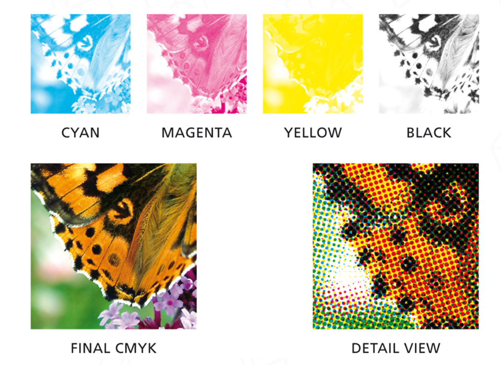

# CMF 设计

人类追求产品更高的颜值，而产品的更新迭代又以外观设计最为频繁。外观设计中，又分为**形态设计**和**CMF设计**.

工业设计
+ 策略设计（研究用户体验生产对接）
+ 外观设计
  + CMF设计
  + 形态设计
+ 结构设计

**CMD** is the abbr. of *Color-Material-Finish*. **CMDF** is the abbr. of *Color-Material-Finish-Pattern*. 纹理(pattern)越发为设计师所重视，产品的纹理由原料本身的纹理逐渐转向主动设计出的、可以表现产品特性的纹理。
**品质**与**品质感** - 
+ 品质由制造决定
+ 品质感由设计提供

“远看颜色近看花❀”，在一定距离上时我们会首先注意外观的颜色。
“颜色话语权帝国” - 潘通 Pantone (PMS-潘通配色系统)
“科学的色彩理论” - CMYK

**潘通和CMYK各自的优缺点**
我们知道潘通的色卡是工厂每一个颜色就配一桶油漆然后用刷子刷上去，所以它的颜色是“实”的，是完全连续的。
但是CMYK是四种颜色的“混合”——并不是我们想象中的油画家的那种对颜料的混合，而是利用了人的物理视觉成像限制  
  人的视锥细胞接受光线的生物特性让微小颜色单位的混合形成**错觉的颜色**.

"丝绸之路”的三种代表性的商品：陶瓷、丝绸与茶叶，其实都不是普通人的日常生活必需品。之所以这三样商品受追捧，让当时的中国——一个非产银国，保存了全球70%的白银，是因为这三种商品代表着一种**美好的生活方式**.
西方艺术在几千年的发展，就是在研究怎样将自然投影到画布上；东方艺术则对真实地表现并无兴趣，真正让东方人在意的是人与自然的联系，而不是无人的世界。
东方人，尤其又是中国人，是真正的、天生的设计师。设计师的终极工作，便是创造美好的生活（方式）。

## CIGA 大猩猩系列

超级好的CMF，表面的加工是从“肉眼很难察觉”、“思维很难分析”出发从一点一滴创造出“高级感” ——张建民：“高级感是很难的！”

参考“江诗丹顿”与“Royal Oak. 张建民：“它们已经把三板斧玩透了！”