## 可持续设计的三个维度

+ 环境 - 尽量减少对环境的损害
+ 社会 - 仍然要满足人的需求
+ 经济 - 商业的可持续的；而非短暂的慈善的

## 中国古代设计中的可持续 —— 《考工记》
《考工记》中提出“天有时，地有气，材有美，工有巧，合此四者，然后可以为良”（其中的“地有气”指的是人文环境）；总而言之，强调“天人合一”的造物思想。

## 鲁晓波 ——清华美院院长 讲可持续设计
> Reference video : https://www.bilibili.com/video/BV1f741137c8?share_source=copy_web

**“为所有人的可持续设计”** —— 第一个问题：谁是人？
+ 从代际间考虑，不仅是这一代的我们，也是下一代、我们的孩子
+ 从所处背景来看，来自不同国家地区的不同民族、不同文化的群体都是人。之所以强调这一点，就是在说：“人”不仅仅是个人，也是群体的，团体、社会、全人类
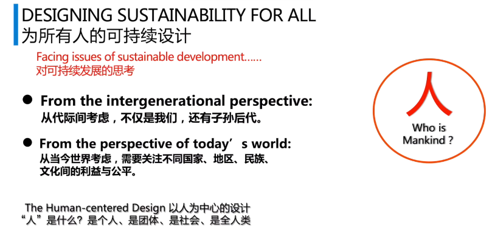
联合国通过的十七个可持续发展目标

设计的任务是“解决问题” - **设计的价值在不同的人类发展阶段的演进**
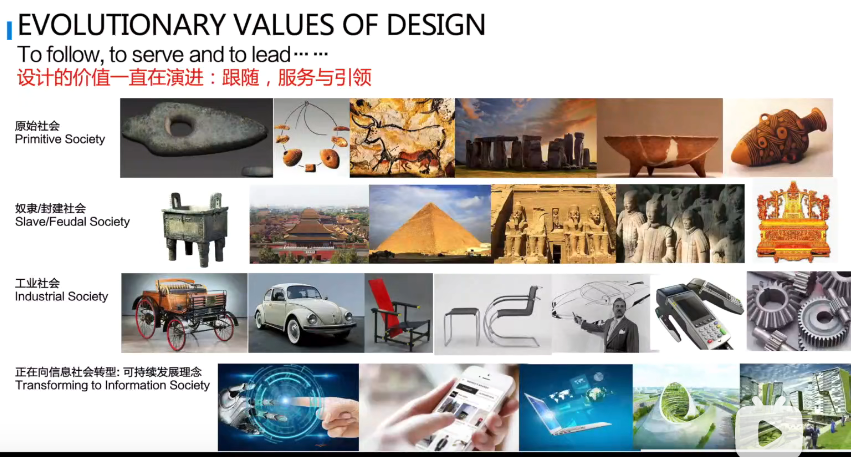
**例子** - 包豪斯向我们展现了人类步入工业社会以后，设计应当是什么面貌、应当怎样介入工业品。

**例子** - 雷蒙德·罗维(1949年时代周刊封面人物) 首位登上时代周刊的工业设计师 - 口号是“形式追随商业”（对比德国设计师提倡的“形式追随功能”）;他的工作让流线型造型成为产品设计的常客；他强调设计并非标新立异，而是市场导向的，他的一句名言是“當商品在相同的價格和功能下競爭時，設計就是唯一的差別". 可以说，他引领形成了美国式的商业设计模式。(Systhesis is innovation 就是他说的)

设计的真正内涵是深刻的思想、哲学 - 顺应时代的
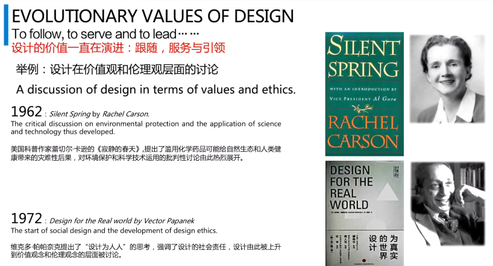
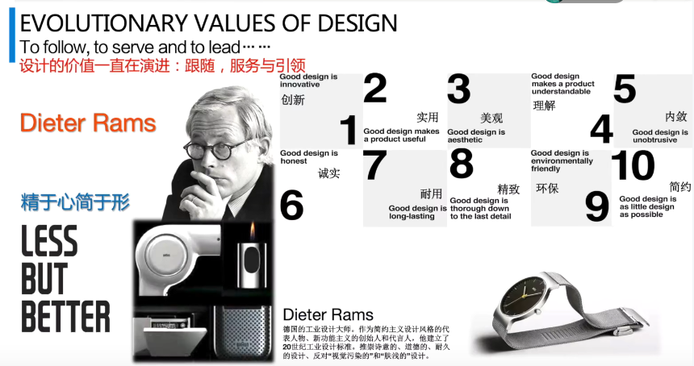

优秀的设计师需要站在整个世界、社会、人类发展的高度来看问题。
比如说对社会过分推崇技术主义的反思——《寂静的春天》.
比如反思设计的对象、设计的目的——《为真实的世界设计》.
比如反思优秀设计的内涵、特征——迪特拉姆斯的设计十诫.

而我们现在正面临的设计问题是什么？
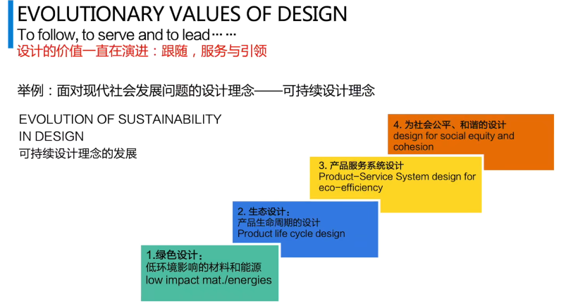
+ 绿色、环保设计
+ 产品-环境的综合系统设计
+ 服务设计、体验设计
+ 社会设计

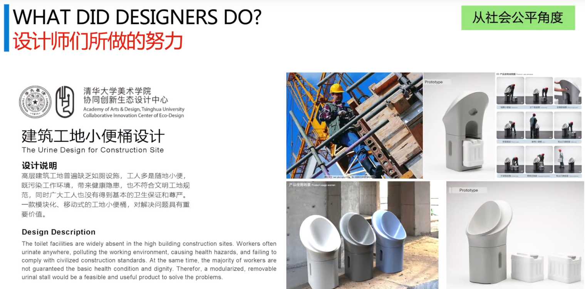
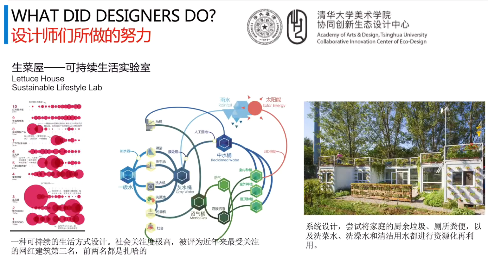
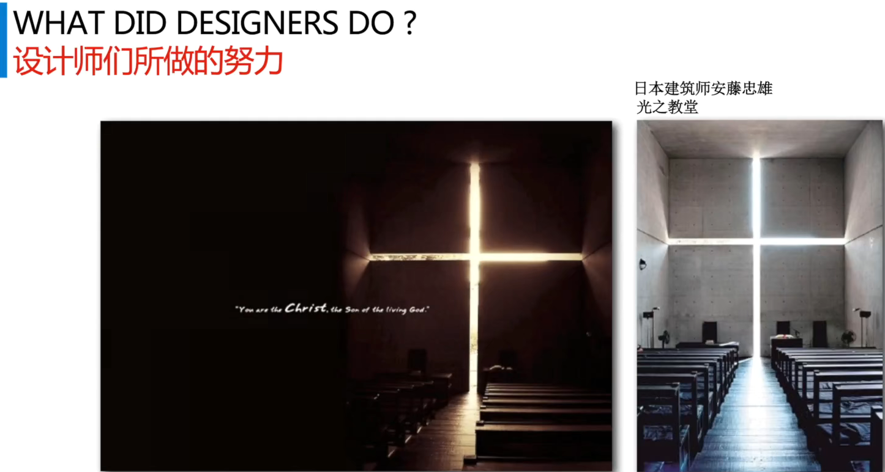
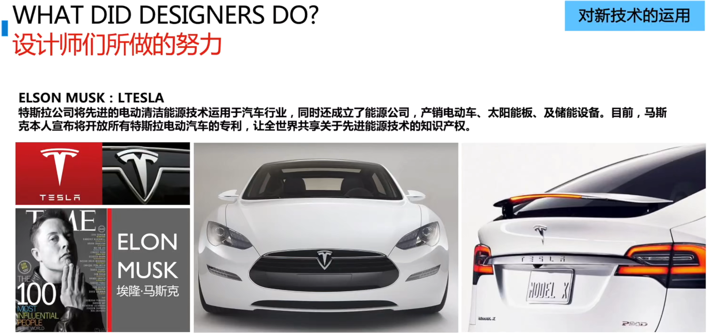

“美是取之不尽、用之不竭的资源。”

## 可持续设计的案例分析

### 农村、偏远地区的坐便器重新设计
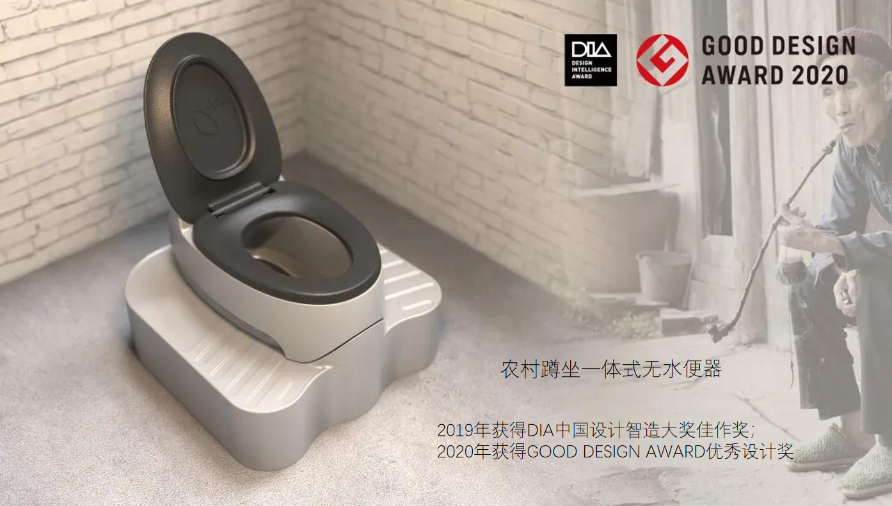
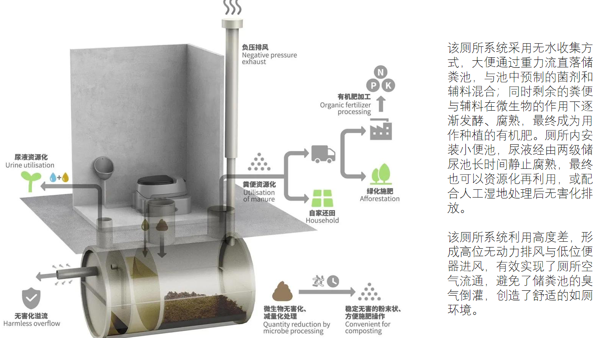
设计师的工作与其视野密切相关。坐在写字楼里的设计师考虑的是谁的问题、谁的苦难？
### 高层建筑的建筑工地的工人如厕问题
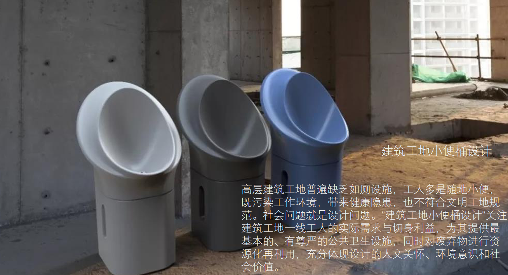
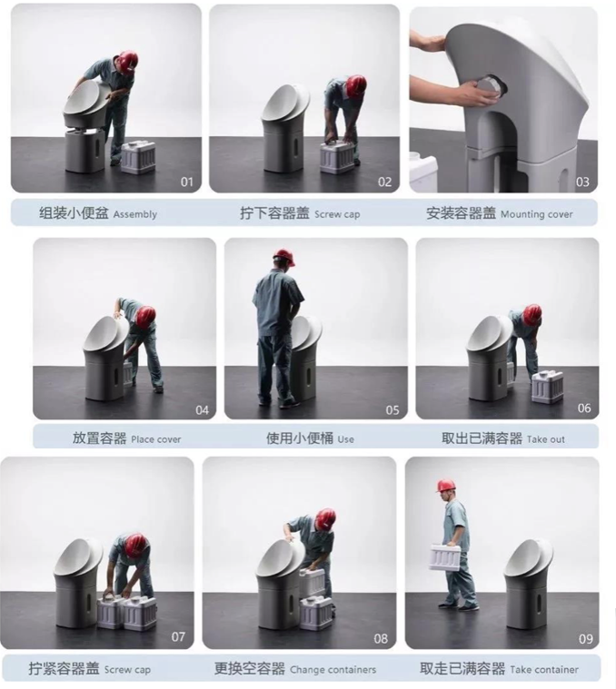
### 流动洗手间及生物处理
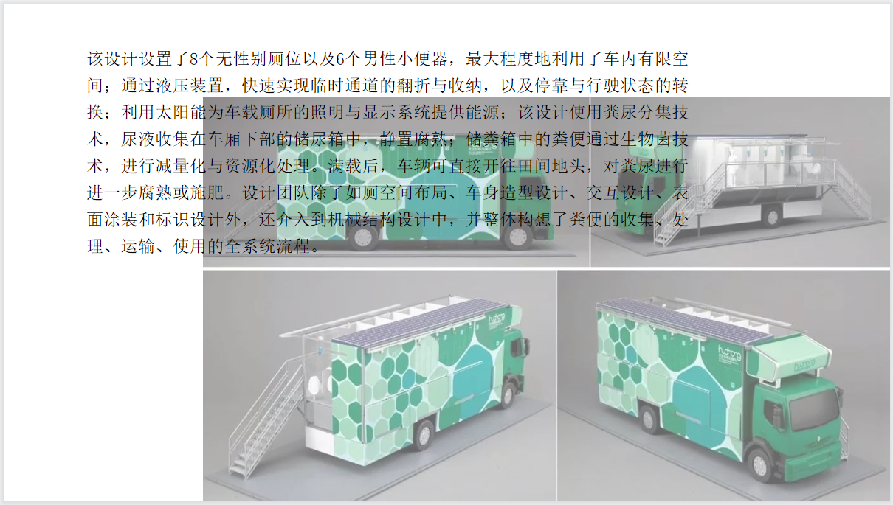

**以上三个工作都是做排泄物处理的工作，但是它们并不是简单地重新设计一个马桶盖、简单地堆砌高级的材料、让马桶镶嵌上流光溢彩的钻石或者让它更智能。这些工作之所以好，因为它们充满了人文关怀、站在弱势群体需要帮助发声群体的角度去做设计。**
### CIGA的