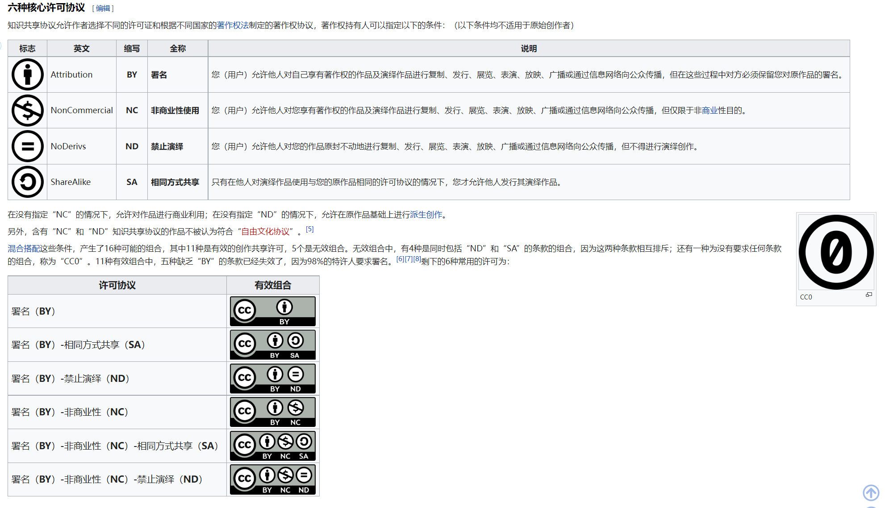
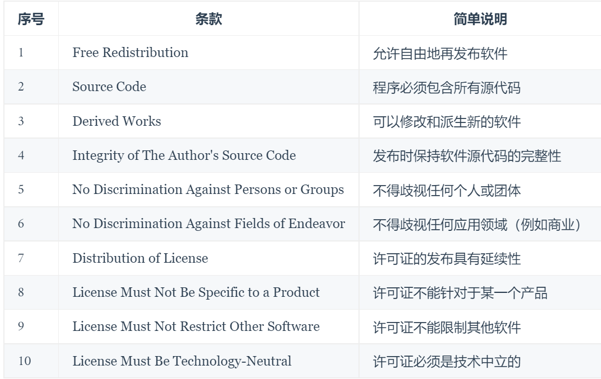

>作者为Toichi Tanaka. 如果你有任何疑问，欢迎联系11911421@mail.sustech.edu.cn
本文遵循CC-BY-NC协议。
本文写作过程中参考了其他文献、资料和视频。相关出处我会在引用时说明。
本文由markdown, html, css写成。
[toc]
# What is Open Source License? 什么是开源协议？
中文互联网对于“开源”的认识越来越多，“开源”一般会联系到软件创作。但事实上，“开源”、“自由”并不仅仅限于软件开发领域。
文本创作、音乐创作与艺术创作和软件代码一样，都是知识劳动/知识创造；我们同样需要对其进行保护。

<!-- css样式开始 -->

<!-- css样式结束 -->

## Creative Commons 
Post一节知乎专栏文章：[“知识共享”（CC协议）简单介绍——漠伦](https://zhuanlan.zhihu.com/p/20641764)

Creative Commons是一个非盈利全球性[组织](https://creativecommons.org/)，同时也指代该组织发布的一系列著作许可方式，也就是[“知识共享许可协议”](https://zh.wikipedia.org/zh-cn/%E7%9F%A5%E8%AF%86%E5%85%B1%E4%BA%AB).

一般来说，CC协议应用范围是文字作品、音乐、艺术作品。软件、程序等不会使用CC协议。下图是Wiki上CC协议的几种类别的说明。你也可以访问CC的[官方说明](https://creativecommons.org/licenses/)来查看。

使用CC协议，作者的版权得以保留；并且作者主动向他人宣告“在协议声明的限定范围内的分享行为可以不向作者告知”，并且主动地宣告作者禁止的使用行为。也就是说，CC协议是**创作者主动性质**的。原则上，CC协议适用于全世界范围（但实际使用时要参考当地法律），CC协议在理论上可撤回，但已经分发(distribute)的授权将继续有效。

CC协议被设计成三层描述（但是描述都都是一件事——协议本身）：
+ 法律层 - 给律师和法官看的
+ 大众层 - 给不深入了解法律的普通使用者看的
+ 计算机语言层 - 给计算机看的，比如搜索引擎、GitHub.

问答题：请解释“本文遵循CC-BY-ND许可”的含义。答案：&nbsp;要求署名+不允许演绎

需要说明，有时你会看到CC协议后跟着一个版本号，比如说CC4.0
4.0版本是目前最新的版本，已经修订以通用于世界范围而无需再等待主动的本地化声明。在中国大陆使用CC协议时建议声明4.0版本。
这一部分请参考[“知识共享”（CC协议）简单介绍——漠伦]并引用如下：
>CC 协议是基于国际法、国际惯例、美国法律撰写的基础版本（即国际版），为适应各国不同的版权政策，一般都需要进行本地化。中国大陆地区对 CC 3.0 协议进行了本地化，以适合中国地区的法律，这也是目前中国最新版本的 CC 协议。根据 CC 组织的说法，4.0 版本在最大程度上实现了在各司法区的适用，从 4.0 版本起，CC 协议可以不必等待各司法区的知识共享组织进行本地化，可以直接使用。目前，在 4.0 版协议发布后，3.0 的中文版就从 CC 官网上消失了，4.0 则还未本地化。本文翻译的是 4.0 国际版的协议。

另外，由于大陆著作权法律不允许著作者放弃版权，因此使用CC协议至少需要有BY声明。
由此可以知道，CC协议的一种：**CC0在中国大陆是无效的。**
CC0宣布创作者放弃一切权利，该作品进入公有领域/公共领域/Public Domain. 所有人都可以以任何方式处置该作品。

## 软件创作的开源协议
中文互联网上的开源观念逐步进入大家的视野。贴出一个开源教学网站，类似于编码的“菜鸟教程”：
[开源指北](https://oschina.gitee.io/opensource-guide/) 该网站由Gitee发起，是一个开源百科编写项目。基本上包含了开源入门所需要的所有知识。

### 开源精神与要求
开源一开始仅仅指软件的开源(OSS)，后来逐渐generalize到硬件开源(Open Source Hardware)、开放设计(Open Design)、开放文档(Open Document). 不仅如此，还在理工技术以外的领域（比如出版领域）同样造成了深远的影响。

根据**开放源码组织Open Source Initiative(OSI)**的定义，开源软件的发行条款必须[包含以下十个条款（满足十个条件）](https://opensource.org/docs/definition.php)：

### 软件开源运动的历史
这一部分的内容参考了该网站内容：[PingCAP - 一文看懂开源许可证丨开源知识科普](https://pingcap.com/zh/blog/introduction-of-open-source-license) 
## Other references
https://www.bilibili.com/video/BV1tL4y1T7z6?share_source=copy_web

https://www.eet-china.com/mp/a47898.html

https://zh.wikipedia.org/zh-hans/Copyleft

https://creativecommons.org/choose/

https://www.zhihu.com/question/51222514

https://www.bilibili.com/read/cv6986215