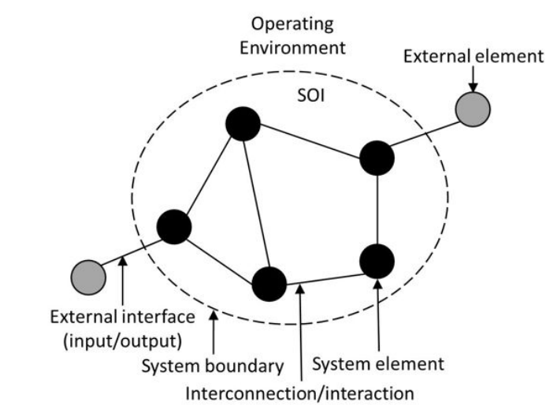
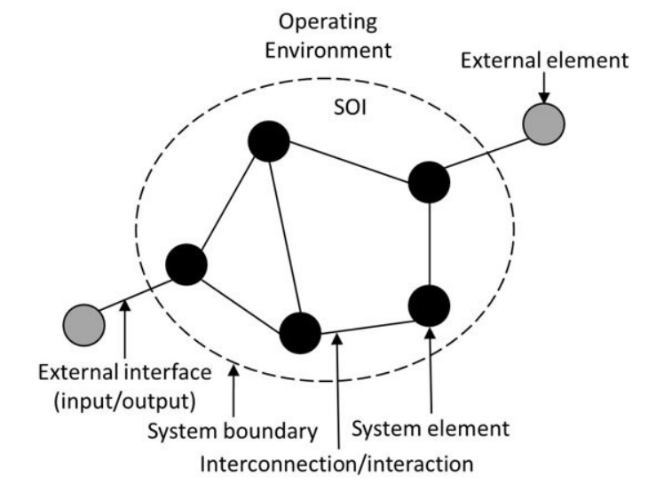
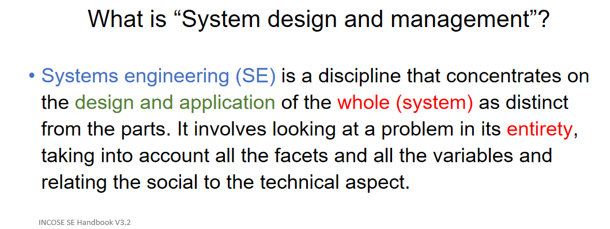
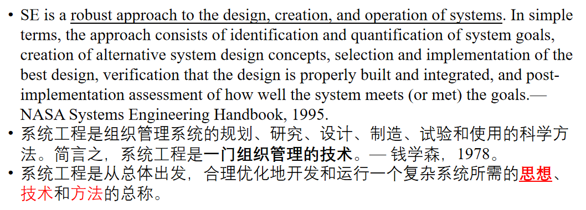

# 第一章 Introduction to System 对系统的介绍（导论）
> Reference book : Introduction to Systems Engineering (Ian Faulconbridge, Michael Ryan) - Chapter 1
---
## 对系统的定义 What is a SYSTEM?

Quoted from ISO/IEC 15288 - **A system is a combination of interacting elements organized to achieve one or more stated purposes.**
**SOI** - System of interest

An SOI includes three parts: its elements, interconnection/interconnections of elemnts, and (external) boundary.

### 对系统的分类 Types of Systems
|分类|区分特征|说明|
|---|---|---|
|Closed/Open|根据系统与环境的关系，具备输入输出interaction的是Open system|我们只关注有用的即开放系统|
|Natural/Human-made/Human-modified|纯自然系统只包含自然过程中的自然元素(natural elements)；人造系统中包含human-made elements or natual elements adapted to human-designed purposes;Human-modified则是改造纯自然系统使其符合human purposes|我们只关注Human-made/modified系统|
|Physical/Conceptual|系统的形式|我们关注物理系统（实体系统）|
|Precedented/Unprecedented|根据这个系统之前是否被实现(has been produced before)来区分|科学研究和前沿开发是unprecedented的；我们在这里只关注precedented|
**Summary - We are interested in open, physical systems that are human-made/modified from largely precedented elements when we are talking about systems enginnering.**

### 系统和环境的关系 A system and its environment
由于我们已经关心open systems，那么这个系统就不可避免地accomodate external elements. 所以我们要对先前的SOI模型做出补充与拓展。

相比于之前的模型，我们加入了对interfaces to external elements in the operating environment的考虑。注意，这里的external operating environment有可能是其他的系统(related system).

### 系统能力 A Capability System

书中讲到这个概念时，举例说一个系统不仅仅是aggregation of hardware or software products，而是一系列的resources operating in its operational environment in order to achieve some purpose. 即：不要仅仅关注到实体的、明显的元素，也要考虑到系统是一个广泛的整体，也包括了：后续的服务、使用环境、产品使用培训需要等等...
我们称以上的combination提供给系统一种能力：**operational capability**，这样（层级）的系统也被称为**capability system**.

我们主要关注的常常是acquisition of the major equipment element(often called **the material system**).

这一点我还不是很清楚，需要后续阅读后返回补充具体信息。
<!-- 讲个笑话，为了翻译好capability system,我还专门跑去振坤那里找中文的书。发现中文讲系统工程的往往杂乱无章、不成体系；互相抄...最后没有找到相关的内容。大国工程，必须要有系统工程的知识！诸君更当努力，为了更好的明天！ -->

### 系统的描述 - 概念系统或物理系统
>A system can be described in two broad way——in **logical terms(functional terms) and in physical terms**...The logical descrption contains the 'whats' of the system, and the physical descrption contains the 'hows'.Both...comprise a series of statements called **requirement**. —— *Intro...by Ryan & Faulconbridge*

我们知道系统有物理系统、概念系统的分类以后，就要尝试去建构系统。概念系统对应**Requirements breakdown structure(RBS)**; 物理系统对应**Work breakdown structure(WBS)**. 二者可以相互对应(mapped into)

在逻辑系统（概念系统）中，系统的目标(mission)被分解称一个其主要功能的层级结构(a hierarchical structure of its major functions).这一结构被称作**logical description/architecture或functional hierarchy/architecture**.

在物理系统中，层级是具有相对性的。比如一辆汽车在汽车制造商那儿可以作为一个系统（包含动力系统、操作系统等等）；而其中的燃油发动机在发动机制造商那里也可以作为一个系统（包含引擎、燃油、涡轮系统等等）。
我们判断能否形成一个系统，其实是一个隐藏的(implicit)要求：一个系统必须能够独立存在(be able to stand alone in its own right).

### 子系统与SoS的区别
Subsystems are therefore invariably sub-optimal when SoS(System-of-systems) comprises elements(systems) that are optimised for their own purposes before joing the SoS.
也就是说，子系统(subsystem)总是要满足于整个系统的最优化利益；而SoS则是由一群首先要求自身最优化利益的系统组成的更大系统。

这个差别很像计划经济下的部门，与市场经济下的各自由竞争的企业。

### System Life Cycle
|Stage|Illustration|
|:---|:---|
|Pre-acquisition Phase|当商业计划开始时，这一阶段就开始了。一般会确定系统解决的早期的商业需求；有时这一阶段也承担了判断这一计划是否应该继续执行、发展的观察(Technically feasible? Cost-effective? Enough funding?)
|Acquisition Phase|Focusing on bringing the system into being and into service in the organisation|
|Utilization Phase|系统的实用阶段。这一阶段中可能对系统做出调整改进以弥补功能缺陷、适应需求的调整|
|Retirement Phase|Following operational use and system support, the system is eventually phased out and retired from service. 假如组织仍然需要capability，那么retirement&nbsp;phase 后面通常就是一个新系统的cycle开始.|

### Acquisition and Utilizatiion phases 获得与利用阶段
这两个阶段是整个system life cycle中的核心阶段。
Acquisition Phase : 
+ Conceptual Design
+ Preliminary Design
+ Detailed Design and Development
+ Construction & Production

Utilization Phase :
+ Operational Use
+ System Support

### Conceptual Design in Acquisition Phase
这里有一个很有意思的点，摘出教材的一段话：
>Although clearly defining the requirements of the system would seem a logical (and essential) first step, it is often poorly done and is commonly the direct cause of problems later in the development process.
>Businiess managers and stakeholders sometimes prefer to describe their requirements in loose and ambiguous terms to protect themselves from changes in their needs and their business environment.

这就很有意思了。我们做概念设计就是为了避免混淆(avoid ambiguity). 为了实现这一点，管理者们开发了一整套的terminology和process.
我们将在后面具体学习它们。

## Systems Engineering 系统工程

### Top-down Approach
>Sysem enginnering begins by addressing the system as a whole. ————textbook

自顶而下(Top-down)不同于传统的工程方法（自下而上），传统的工程方法在问题是明确且直接时是极其有效的，但是我们今天面对的问题大多是复杂、混淆的。使用Top-down方法的步骤是层层分解，直至"until a complete understanding is achieved of the system from top to down"

在定义、探讨、分解的过程中，我们对系统组件的联系会理解地更加深刻，有助于我们实现交互边界的确定与设计("the interaction between the components can be understood more thoroughly, which assists in identifying and designing the necessary interfaces between components/internal interfaces and between this and other systems/enternal interfaces").

但是，即便如此，我们仍然要重复一点——在实现工作(Implementation)的层面上，我们仍然需要Bottom-Up来做。我觉得textbook中的这一段写得非常好：
>That is, one of the aims of system engineering is to provide a rigorous, reproducible process **by which the complex system can be broken down into a series of simple components that can then be designed and built using the traditional bottom-up engineering approach**.
>Imporotantly, therefore, the second principla facet of systems engineering is **to provide a process by which** the components, assembles, and subsystems,i.e., **things that are parts of the larger system, can be integrated to achieve the desired system purpose**. 

Summary - 
1. 经过SE分析后，项目可以被传统的bottom-up方法做起来
2. 组成部件是可顺利组装（整合、构造）以实现系统目的的