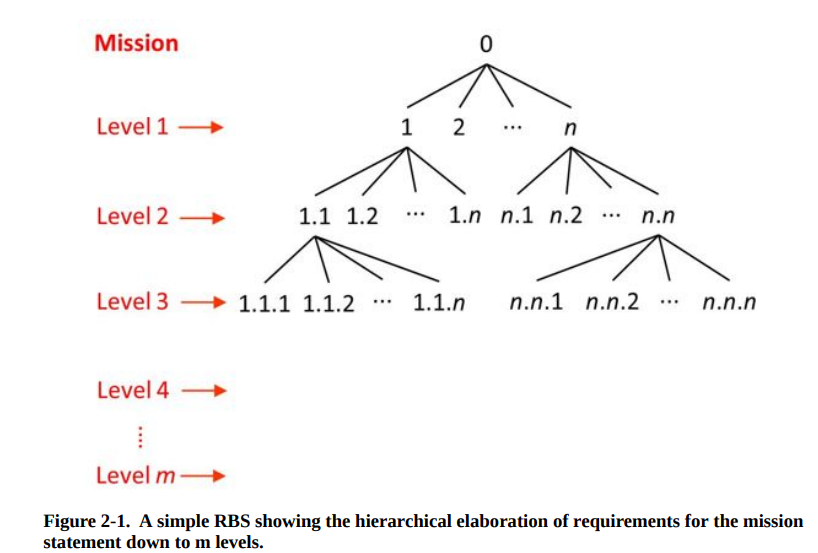

>本文作者为Toichi Tanaka. 本文参考资料已在文中给出。
如果你有任何疑问，请联系11911421@mail.sustech.edu.cn.
本文遵循MIT开源协议。
[toc]
# Requirements Engineering Framework 需求分析框架
>参考资料为Ryan的*Introduction to Systems Engineering*

## 需求与需要文档 Needs and Requirements Documentation
Gathering requirements in a formal sustematic way is referred to generically as **requirements engineering**.

我们需要知道，审视一个项目可以从几个不同的层级来看：
1. Enterprise view - enterprise leadership sets the enterprise strategies and concepts of operations
2. Business management view - 从商业管理的角度出发定义needs和constraints并且形成requirements
3. Business operations view - stakeholder利益相关方要求define their need and requirements
4. System view - 系统观点下确定概念系统和物理系统
需要说明，上述的前三个系统都是在problem domain也就是问题层，只有最后一个系统观点是在solution domian也就是解决方案层。
引用书中的话就是：
>The problem domain is generally considered to be the responsibility of those who have ownership of the problem to be solved, so the descriptions of the system are predominantly in the language of the customer's business management and business operations, focusing on **what the system needs to be able to do, how well it should be done, and why.**
上面的这个问题层描述都是logical/functional的descriptions.

对于解决方案层面(Solution domain)，考虑的则是implementing the solution，所以在engineering and physical terms（物理层）, **"focusing on how the problem is to be solved——that is, how it will look once it has been implemented."**

上面的这些层级都是vertical views of the process，还有每一个vertical views的horizontal views: **the Needs View** and **the Requirements View**. 这两个词在中文中的翻译似乎是一样的，但是在实际英语语境中是有不同的。
+ **Needs**是商业语境(in the language of the business at the business management or business operations levels)下对需求的描述(state capabilities)
+ **Requirements**是对needs的可验证的建构性描述。书中的原话是**"Requirements are formal structured statements that can be validated"**；需要说明的是：一个needs可以对应数个requirements.

我们在Business managment层级对应的是Business Needs and Business Requirements；在Business operations层级对应的是Stakeholder Needs and Stakeholder Requirements.我们下面逐level讲解从needs发展到requirements的process.
|层级|名称|介绍|
|:---|:---|:---|
|Business Management Level|**Business Needs and Requirements(BNR)** Definition Process|这个层级的定义过程出发点是组织的商业愿景(vision)，目标和目的(goals and objectives)以及Concept of Operations[(ConOps)](#ConOps).由此管理层面（管理者）定义了Business Needs，以Preliminary Life-cycle Concept Documents[PLCD]($#PLCD)展示。之后再从Business Needs发展、形成Business Requirements，一般会以形成文档的方式呈现，称为Business Requirements Specification[(BRS)](#BRS)或者叫做Business Requirement Document.|
|Business Operations Level|Stakeholder Needs and Requirements(SNR) Definition Process|在这一阶段，基于上一阶段所得到的ConOps和PLCD文档，需求工程师们(requirement engineers)和stakeholders一起通过一个structured process来确定利益相关方的需求，一般以refined OpsCon document和其他Life-cycle Concept Document[(LCD)](#LCD)来记录；然后再转化成Stakeholder Requirement，以Stakeholder Requirement Specification[(StRS)](#StRS)|
|System Level|System Requirements Definition Process|上一层级得到的StRS被需求工程师们转换成系统需求(System Requirements)，写成System Requirement Specification[(SyRS)](#SyRS)。由于在这一层次中产品被分解成数个systems，所以对于每一个system都可以发展出单独的[LCD](#LCD)|

|名词简写|名词全称|说明|
|:---|:---|:---|
|ConOps|Concept of Operations||
|PLCD|Preliminary Life-cycle Concept Documents早期生命周期概念文档|PLCD中一般要包括[Preliminary Acquisition Concept](#Acquisition_Concept), Preliminary Operational Concept[(OpsCon)](#OpsCon), [Preliminary Deployment Concept](#Deployment_Concept), [Preliminary Support Concept](#Support_Concept) and [Preliminary Retirement Concept](#Retirement_Concept)|
|BRS|Business Requirements Specification商业需要说明文档|从商业上的愿景、考量出发|
|LCD|Life-cycle Concept Documents生命周期概念文档|由[PLCD](#PLCD)发展而来，在business operations level加入了对stakeholder needs 安定requirements的考量|
|StRS|Stakeholder Requirements Specification利益相关方需要细则|在概念阶段对问题的延申(加入了对stakeholders的考虑)，但是仍然没有涉及具体的操作，是提出、发现、定义问题的加深过程|
|SyRS|System Requirement Soecification系统需求细则|SyRS也可以简写成SS(System Specification)|
|OpsCon|Operational Concept 产品操作流程概念|试想产品如何交付给用户并被使用者使用；其在ConOps的背景(context)下得到并由business management level向business operations level的过程中由preliminary阶段实际考虑了stakeholders的需求，因此在businees operations level的definition结束以后contains Stakeholder Needs.|
|Null|Preliminary Acquisition Concept|描述了系统如何取得（获得），包括了利益相关者组织(stakeholder engagement)，项目需求定义(requirement definition)，资源募集与协约(soliciitation and contracting issue)，设计、生产与验收(design, production and verification)|
|Null|Preliminary Support Concept|支持系统或者说是“售后”系统？它描述了为了支持系统部署后能够维持正常运转所需要的infrastructure and manpower。一个支持系统需要操作支持(operating support)比如机床代加工、engineering support工程师服务支持、维保支持(maintenance support)，supply support（补给支持）比如军队后勤支持以及技能培训支持(training support)比如一些软件推广时会有专人培训使用|
|Null|Preliminary Deployment Concept|部署的概念描述了系统如何被证实可行(validated)，分发到使用者手中(delivered)，投入到实际使用(introduced into operations)|
|Null|Preliminary Retirement Concept|描述了系统废弃后如何处理(be removed from operation and retired)，比如一些被使用的或被产出的有害材料如何处理|

## What is Requirement? 什么是需求？
A requirement consists three parts:
1. 系统必须要做的事情 Something that the system must do
2. 系统必须具备的质量、属性 quality or attribute
3. 系统开发与使用的约束 constraint

我们之前介绍过几个层次的系统：BRS, StRS, SyRS. 其中前两个相比于后一个不那么formal.无论是哪个层次的系统，都包含以下几个不分：
+ 需求声明 Requirement statements
  + 系统所需要提供的功能与服务：系统需要做的，或者系统需要采取的行动(functional requrements)
  + 系统所必须具备的质量、性质和属性(qualities, properties, or attributes). 一般被称作“非功能性需求”(non-functional requirements)
  + 系统必须遵守的限制，例如在什么样的环境下工作、或者开发环境（有时候这些限制被归类到非功能性需求里面）
+ 效果、验证以及对每一条声明的需求的合情合理的解释
+ 系统需要integrate或interface（与之集成或从接口进行交互）的其他系统的定义、声明与解释
+ 系统的工作内容(Information about the application domain within which the system must operate)

一般情况下，需求说明应当关注系统应该做什么，而不是怎么做。当然有一些不可抗力情况下也需要在说明中包含“怎样做”。但是，非必要情况下，仍要确保BRS,StRS，SyRS提供logical specifications而不是physical specifications（前者在问题domain，后者在解决方案domain）。

Emergent Properties **涌现性质**
系统中的一些性质必须要集成后才会出现，我们把这样的性质称为涌现性质(emergent properties). 这些性质的特点是：
1. are possessed by the system as a whole
2. 只有所有individual subsystems have been integrated后才会出现
3. 一部分in isolation的系统（组成部分），不会展现这些性质
4. 却决于组分与组分之间、环境与组分之间的Interaction

涌现性质必须在top-down方法中被定义。涌现性质可能并不被预期，且结果不一定是好的性质。

书中举的例子是**自行车**, since it can only perform its principal function when all subsystems, including the rider, have been integrated.

## 什么是需求工程？ What is Requirements Engineering? 
总结来说，需求工程做三件事：
1. 确认context
2. 确认context下商业和利益相关方的需求与需要(business and stakeholder's needs and requirements within context)
3. 给出符合Needs的需求与细则

引用书中的原话：
> (From the view of the business management,) Unless the requirement set is well defined, the project has no firm base and the resources allocated to it will be inapproprate...If without sufficient oversight, the business may be held to ransom（被胁迫）by stakeholders insisting on unrealistic requirements that business management have not approved.
> (From the project manager's perspectives, ) the set of requirements is an essential part of the definition of the scope of the project...a well defined scope(set of requirements) is necessary to able to justify any expenditure of funds or effort within the project, and eventually to be able to determine when the project is complete.

我来总结一下原书的观点：
1. 从商业管理的角度来看：需求定义与分析涉及到一个组织的有限的资源的分配问题。如果连需求是什么、需求的问题规模有多大都不知道，怎么能够合理地分配资源来完成任务、解决需求呢？
2. 从项目经理（管理人）的角度来说，需求定义与分析确定了项目的格局(scope of the project)。项目管理层面需要以需求工程的结论作为Base来进行如工作分配、进度报告、确认工作完成情况等管理工作。

**需求工程**是一套rigour, formal methodology. 依据需求工程的流程，可以提供"the best chance that we begin the project with a set of requirements that is complete, balanced, comprehensible, feasible, and consistent"。这样做可以带来很多益处，比如调和商业管理者与利益相关方的观点（目标）、更加积极地拥抱（需求上的）变化等等。

### Requirements Elicitation and Elaboration 需求生成与发展

我们在做系统设计工作时，都知道要从需求出发。我们也知道，需求工程可以分成三个阶段(BRS, StRS, SyRS).这是一个从高层级向低层级的发展过程。在每一个层次上的需求，都是经过三个过程才确定的：
1. Elicited requirements 引出需求。从上一层得到的需求，是可直接获得的（比如从business manager or stakeholder那里问到）
2. Decomposed requirements 分解需求。从引出需求分解得到的子需求、更加具体的需求。书中举例子：一个飞行器在特定场地降落，那么跑道长度、飞行器重量、合适的航空指挥系统等等就是子需求。*In decomposition, the need for the children requirements is obvious in the parent.*需要说明的是，当子需求被定义好后，父需求就是冗余的了（total meaning of children requirements is equivalent to that of the original requirements）。
3. Derived requirements 推断需求。引出需求可能并没有直接说明的需求，但是可以从引出需求推断出的需求称为推断需求(Derived requirements)。需求工程师们需要做一些推断、发散才可以得到该种需求。*(Although not directly stated, ) derived requirements is a necessary part of the system design if one or more of the directly stated requirements are to be met.*

在需求生成阶段(State of requirements elicitation),需要engagement with the stakeholders. 这个engagement的方法有很多哈，书上给了一连串比如facilitated structured workshops, brasinstorming, interviews, propotypes等等。

#### 为什么需求发展过程中需要层级性(Hierachy)
1. 需求工程师可以将系统分解为复杂性较低的任务，更好地被理解与交流。
2. 分解后的工作(tasks)可以managed within the limitations of human/organization's ability.
3. 层级性提供了可追溯性。*Traceability is assisted by a hierarchical numbering of requirements.*

### Requirements Validation 需求验证
需求验证的原则就是“逐级向上负责的验证”。
但是要说明的是，由于在系统设计的早期阶段——概念设计阶段，我们是面向stakeholders和business needs的，就没有一个明确的baseline（不像后面流程都是以上一级的结果为Baseline）.验证的最关键点就是*ensure that we have a complete set of requirements that, in their aggregation, represent the system required by the stakeholders and meets the business needs.*

### 需求文档的撰写 Requirements Documentation
一份需求文档的五条守则：
1. 确保每一条需求是必要的、简短的、定义明确的。
2. 给每一条需求都定义好合适的条件（定量或者定性）。
3. 确保每一条需求都是可验证的，可确定是否完成的。
4. 避免过度的细化(over-specification)，不必要的约束(unnecessary constraints)和没有边界的说明(unbounded statements)。
5. 最好定义一个标准的模板来描述你的需求，以确保可读性。使用简短的句子或段落，合理地使用表格、公式等来帮助你消除混淆(ambiguity)。

### 需求管理
需求管理要求建立一个合规订的(compliance)流程来对需求的产生、发展与验证追溯进行管理。低层次的需求需要被充分理由地声明(be justified). 另外，由于需求可能会发生变化(changes to requirements)，需求管理也需要考虑到如何建立一个formal procedure来对变化进行管理。

#### 变化管理与可追溯性 Change Management and Traceability
**Def of requirements traceability:** allows us to be able to identify where each requirement came from, what requirements are related to it, and what requirement(s) stemmed from it. Contrary to "from" it, we could also identify all requirements affected by the change if a requirement must change for some reason.
There are two kinds of traceability:
1. Forward traceability
2. Backward traceability

**Forward traceability** allows us to ensure each requirements have been addressed in design, i.e., design decisions can be traced from any parent requirements or we say any system-level requirement down to a detailed design decision(a child requirements).对于每一个需求来说，我们都要在subordinate design documents中找到至少一个child来确保所有的需求都有对应的实现。
**Backward traceability**的重要性在于我们不想要冗余设计。那么，在需求工程阶段，我们要保证下一个阶段的每一个需求都是从上一个阶段的父代需求(parent document)中产生的。Backward traceability可以让orphan requirements out-of-scope.

#### 需求管理工具：RBS和FFBD
在RBS中，需求都以一个**树状结构**呈现(a tree-structured elaboration of the mission). 与RBS相像的一个树状结构是**WBS(Work Breakdown Structure)**，但是WBS是physical work packages and other project-related work的结构，RBS则是logically / functionally的。**RBS也被称为 functional hierarchy**.

RBS之后会发展出StRS和SyRS，都是将需求更加具体地说明。使用RBS有几个好处：
1. 这个framework可以作为一个reference source从而系统的方方面面的需求都能be addressed而不会被omitted.
2. 允许多人协作，可以有效地分配工作与责任(responsibility for sections of requirements).
3. 避免了需求的重复提出(duplication of requirements).需求的重复提出会带来conflict between requirements 并且导致概念的混淆与工作的混乱。

关于树状结构，要注意**并不是所有的系统都可以用树状结构描述**。要以实际情况为主（当然绝大部分架构都是可以用树状来描述的）。

**FFBDs是 Functional Flow Block Diagrams的缩写**。FFBDs可以有效地和RBS结合使用，来显示functions之间的关联(interrelationship of the functions).无论functions是sequential还是parallel都可以表现。FFBDs同样是top-down的hierarchical decomposition结构。*Every top-level block can be expanded(decomposed and derived) as necessary to ensure that the functionality of the system is adequately defined.*

可以参考下面这个视频来学习FFBDs-[Youtube ENGN2225 OC - Functional Flow Block Diagrams](https://youtu.be/Ii1MI68MKDs)
可以看到，视频中还说明了一种**MFBDs**的结构，是Maintenance flow即维护（正常工作）的流程图，是当功能出现异常时处理流程的说明。