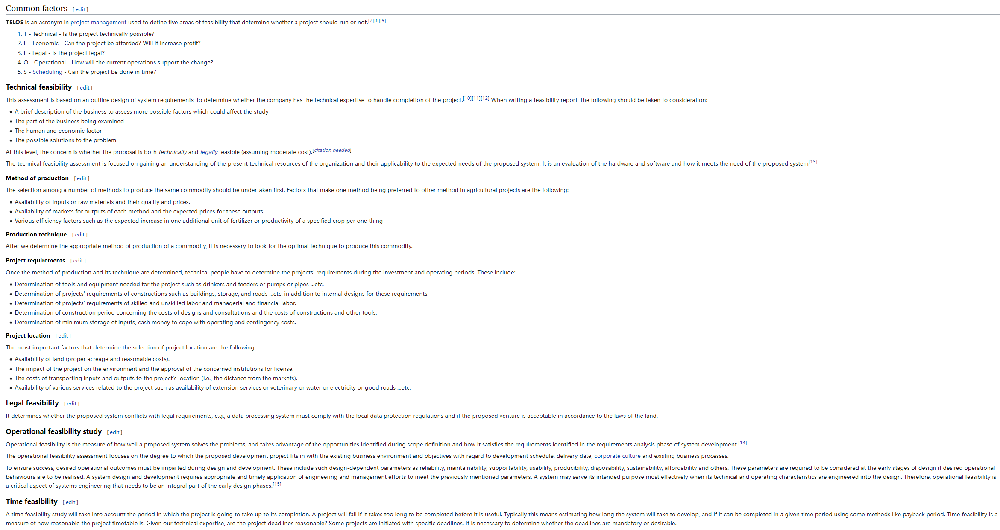

[toc]
# Conceptual Design 概念设计阶段
概念设计的产物是FBL(the Initial Functional Baseline). 这个baseline提供一个系统层级的逻辑架构(logical architecture). 由于概念设计还在问题层(problem domain)，因此它与用户（客户）联系紧密（一切从用户开始）.

为什么我们说概念设计是产品设计生命周期的最重要的一个环节？
1. 概念设计对系统的定义有很大的影响。随着项目的推进，系统的定义会从简短的商业需求(business needs)发展到几百页的系统层级的逻辑需求，好的概念设计将帮助完成这一定义的拓展。
2. FBL将作为后续的延申的系统设计的traced back base.所以在前期尽量不要犯错！任何error都会在拓展过程(expansion)中被放大。
3. 概念设计将问题域联系到解决方法域（transition from the problem domain into the solution domain).也是customer(the acquirer)和developer达成的一个联系、平衡的重要过程。所以概念设计的产物--FBL就代表了Business&Stakeholder的Needs&Requirements.

下面我们讲一下如何进行概念设计：五个步骤，一张图。需要说明的是，五个步骤是Iterative(迭代)的，当然设计也是迭代的。

# C1 stage - Define business needs and requirements - BNR
在这一步，我们要做的工作是确定主要的Stakeholders和Constraints.需要注意的是，constraints和requirements总是联系在一起的。Constraints的类型有很多种，接下来会详细介绍。

## C1 - Who are the major stakeholders?
很多人在确定主要的利益相关者时会犯“列举”的错误，也就是将所有可能受到影响的人都假定是利益相关方。书中举了一个例子：
>银行所使用的ATM系统，运钞的安保人员算不算stakeholders?

尽管他们的requiremetents place considerable constraints on the design of the system, 但他们不会作为stakeholders被考虑。在类似的公共产品设计中，如果采用列举额的方法确定stakeholders，那几乎是无穷无尽的。
我们通常使用的确定原则是：一个stakeholders（组织或个人）必须有权利影响系统的输出(has a right to influence the outcome of the system)；而不是简单地以（可能会）受到系统影响来划分。

## C1 - What are the constraints?
限制、约束(constraints)是另外一种形式的需求。(Constraints are requirements that are imposed on the system in some way.)
对于约束的分析我们采用自顶向下的方式。
1. 商业约束(Business Constraints) - 包含管理指导、机构政策、机构标准、行业对于系统开发的指导准则。这一层面的约束主要是出于商业上的而非具体项目操作上的，涉及到公共关系、合同承包政策、人力资源情况、生命周期全流程考量(use of established life-cycle processes). 举一个例子，近期国内三大航空公司给空客下了：“世纪订单”。很多人问为什么不买国产的C919，理由是C919产能不足，且各个航司基本对空客、波音等老牌航空飞机manufacturer的飞机后勤保障体系建立得更好，短时间内无法为C919建立完善的后勤保障体系；而不买波音的理由就更简单了，政治对抗，这也是商业约束的一部分。
2. 项目约束(Project Constraints)一般指：预算限制、开发周期限制与技术标准限制。比如说，设计移动式房屋，需要满足一定的行业标准，安全性、移动性等等。
3. 外部约束(External Constraints) - 各国的法律法规、行业标准、道德风俗要求、此系统与其他系统进行交互的操作性要求、竞争对手的情况、市场上人力资源的情况、行业的特殊技能需求...一般来说，非具体项目操作的约束、不可控的约束，都是外部约束。
4. 设计约束(Design Constraints). 这个约束一般指辅助进行设计、开发、建造和生产的要素的约束。比方说新科技的引入、基础设施的升级与工人的技能提升。这些要素的特点是“直接地”与系统设计的实现与运转相关。

总体来说，进行约束分析时遵循的原则就是自上而下、由抽象到具体、从宏观到微观。其实没有必要严格地确定“什么什么是哪一类约束”，大致分类一下就可以了，有许多约束其实是重合在分类中地。

## C1 - 细致地确定Business Needs
确认了谁是stakeholders和存在什么constraints后，要考虑的事情就变成:确定利益相关方的考量(Elicit business intention)。
### C1 - 愿景、目的与目标 Mission，Goals, and Objectives
Mission（一般翻译为愿景）要求简短但能够覆盖方方面面的说明(succint but thorough). Mission要能够承担利益相关者的对项目的共识。
在得到一个drafted的mission statement以后，我们要做的是确定goals和objectives. 简单来说，Goals是相对宽泛一些的statements,对mission的延申，又继续延申(spawn)出更多的更细致的Objectives.在这样不断延伸、发展的过程中，我们要注意不要让新生的statements变得odd，也就是说，一切都要从旧的定义、认识中有源地发展出来，而不是凭空跳出来（要有记录的源头）。
Mission并不是一成不变的。Mission承载了business层级上我们对项目的认识、建设与期望，而当项目稳步发展时，我们会对这个项目本身及部署的环境、实际的形势有更深入的理解，这个时候我们要做好准备更新我们对mission的statement.
另外，一般来说我们的系统会面向广阔的社区(broader community of stakeholders)，我们在先期管理团队（小团体）讨论完mission, goals与objectives以后要将result拿出来和更大的相关群体讨论。我们最后要得到的有效的文件是*a formal set of statements that provide a complete, balanced description of the system, covering all aspects of operation, support and maintenance.（一份正式的、规范的说明，对系统及系统的操作、支持与维护有完善的阐述）*。之后的所有subsequent的requirements都要能够溯源(traceable)到这份文档。
### C1 - 定义先期验收标准 Define Preliminary Validation Criteria
书中对这一工作给了好的定义：
>Broadly, validation criteria encompass any mechanism by which the customer will measure satisfaction with the products of the Acquisition Phase.

翻译一下就是：用户对预期产品会有哪几个方面的期望？这些方面就是验收标准需要提前制定以进行设计验证的。
### C1- Preliminary Life Cycle - Preliminary Retirement Concept
Retirement的中文翻译是“退休”。当然，作为产品和服务来说，“退休”就是不再按照预定的计划继续使用。关于产品的“退休”，我们很好理解；而“服务的退休”，我想到的例子是：电话运营商XX服务下架了，怎么对消费者继续承担责任、怎么补偿消费者，或者是XX发廊倒闭了，怎么保障储蓄消费者的权益。
我们在Chapter2已经介绍过preliminary life cycle. 但是我们在这里仅再强调一下retirement concept. 由于是conceptual design stage，我们并没有真实投入生产使用的反馈。我们需要想象三个可能性：
1. 什么原因可能会导致retirement？ (identify the reasons for potential retirement)
2. 系统retirement的可能的方式、方法？(identify potential reirement methods for the system)
3. 这些方式、方法的设计问题？(design issues that may arise from the consideration of each retirement method)

## C1 - Scope System
"Scope"在中文中一般翻译成“范围”、“区限”。简单来说，这个系统就是描述目标系统所处的工况环境、与其他系统的联系。我们一般用一种工具来描述scope system——context diagram（工况图）。

系统边界的确定(Define System Boundary)——其实类似的工作在project management中也在做，称为“项目边界”(Project Scope).系统边界上一般是众多的interfaces。这些interfaces是横跨、联系本系统与外界的系统、环境与项目的(system of interest, external systems to which it is interconnected). 这些interfaces要精心设计，来完成系统的功能。

## C1 - Define Business Requirements
到达这一步前，我们已经在business mangement level确定了needs(requirements)并利用scope system对context和interconnection有了认识，我们再往后走就逐渐接近solution domain（解决方案域）。
这一步的主要工作就是transformation of those needs into formal requirements（将这些发现的需求转化为正式的、待执行的需要的工作）。

### C1 - [Feasibility Analysis 可行性分析](https://en.wikipedia.org/wiki/Feasibility_study)
在概念设计的阶段，我们要求所有的business management statement必须是logical terms（逻辑描述的）。这些逻辑描述的needs都是问题域(problem domain)的，在向解决方案域(solution domain)转变时，我们要意识到*each alternative solution class may represent a completely different type of project*（每一个可能的解决方案都代表着朝向一个完全不同的项目）。
Feasibility Analysis（可行性分析）的目标是*narrow down the solution domain so that the subsequent project can be managed effectively*，即缩小解决方案的可能（确定问题的解决方案）来让后续的项目管理变得有效。之所以要做这一步，是因为设计的广度是巨大的（这有点像双钻图的第二部分, the seond part of double diamond model）。

Feasiblity Analysis仍然是business management decision，还不涉及到stakeholders的商业执行层面(business operational level).

### C1 - Define Business Requirements - RBS
这一步主要是利用一个工具框架(framework)来生成一个层级性的(hierachical)结构。工具是**Requirement 5s breakdown structure(RBS)**.

上图是一个家用的安全警报器的RBS.我们看一看最左侧的一个function(need)是对未经许可的闯入进行威慑、阻挠。在下一级结构中有四个solutions(requirements-待实现的需要)，分别是：
1. 在邻近的房屋进行威慑
2. 在庭院中进行威慑
3. 在房屋内进行威慑
4. 防止系统失效

我们可以看到，这个RBS记录了从一个need（威慑未经许可的闯入者）扩展到(decomposed, derived into)四个待实现的需要(requirements).根据我们先前的定义，这四个小点一起就能够完全地实现这个“威慑未经许可的闯入者”的need.
之后的StRS, SyRS就是从RBS继续扩展，最终到Physical domain，落实到用技术实现。

# C2 stage - Define Stakeholder needs and requirements - SNR
After business management confidently defined the problem domain in sufficient detail to communicate their needs and requirements to the stakeholders at the business level, these stakeholders then go on to develop their needs and requirements (we call it SNR) within the context of BNR.

The outcome of further development of BNR brings out LCD and StRS. We will discuiss them latter.

## C2 - Define Stakeholder Needs
先前定义的操作场景(operational scenarios)会被加深定义到更加细致地、更接近实际应用需求的场景(ofen called vignettes). 
*这里的vignettes可以理解为：一张中心清晰，但越向边缘越模糊，最终消失的照片*
之所以要有这一步，是因为various stakeholders比上个阶段的business management level更加接近实际的、具体的开发、使用场景，他们的意见将PLCD（早期产品生命周期）文档补充为LCD（产品生命周期）。

这一阶段的产出应当受到再一次检查(review)，来确保所有的new ideas被大多数的stakeholders赞同、支持(endorse)，然后再再Business management层review，来确定可行性。

## C2 - Define Stakeholder Requirements
在这一步，就要将needs转换成requirements.再一次，我们在这里使用RBS Structure来帮助我们细致、无遗漏地完成BNR到StRS的扩展。

和Business level的transform一样，从needs扩展到requirements，肯定还会遇到多种选择(multiple class)，我们在上一步(business management level)使用了[Feasibility Analysis](#Feasibility-Analysis).在这一步我们介绍一个新的角度，不从“是否可以实现”的角度进行讨论，而是从“Trade-off”的角度。
Trade-off study的意思就是：产品的几项指标可能无法同时提升，让一项指标变得更好，就会使其他指标变差。这个时候，哪一项指标更重要、指标的最低要求约束是什么样的，就拿出来研究，做出取舍。这就是trade-offf. 在stakeholder提出needs以后，设立trade-off的标准或原则，然后甄别needs-requirements的途径，最终得到requirements.

## C2 - Last step: work out StRS
StRS就是stakeholder requirements（也被理解为user requirements）。好的StRS可以使阅读者读完StRS之后，能够了解以下几个方面：
1. The likely applications or missions for which the system is intended. 系统要做什么工作。
2. The major operational characteristics to be exhibited by the system. 系统主要的操作过程（来实现最主要的功能）。
3. The operational constraints that limit the design and development of the system.系统设计与开发最主要的限制是什么。
4. The external systems and interfaces with which the system under development must operate.系统必须涉及的其他系统以及与之联系的接口是什么。
5. The operational and support environment within which the system must exist. 支持系统工作与发展的环境是什么样的。
6. The support concept to be employed to support the system and enable it to continue performing in accordance with customers expectation. 使得系统可以持续满足用户预期的开发、改进理念，最好这个理念本身也可以使系统发挥其最大特色、优势。

# C3 stage - Define System Requirements
系统层级的需要的定义：
>The aim of system requirements def is to determine what the system must do in order to meet the stakehjolder needs and requirements, i.e., to describe the requirements at the system level and be able to relate the logical design back to the SNR, particularly the StRS.

在System Requirements的定义中，最重要的是concentrate on what is required rather than how to do it. 书中举了一个例子：一个无人机需要定速巡航功能，来perform这个function的physical subsystems并不是这个stage需要考虑的事情，这是latter stages的engineering问题。

**如果过早地去考虑如何(how to)实现这些需要(meet the requirements)，设计就会走样(ill-informed)**，或者说，会导致次优的设计方案(sub-optimal design). 这一点是由于消费者、使用者(customer)天然地倾向于说出他们“想要什么功能”，而不是“用什么办法实现什么效果”。一旦我们提早地考虑“如何做”，设计工作就会出现一种风险：关于系统表现(system performance)实现的责任与风险(responsibility and risk)从承包商（或者其他实现物理系统的团队）(contractor)转移到(shifting to)消费者、使用者身上。最简单明了的反面例子就是：设计了一个及其复杂的物理系统，然后“教育”消费者如何使用这个物理系统。

一般来说，我们依旧使用RBS方法来构造、标识system requirements.

## C3 - Perform Requirements Analysis and Allocation 开展需求分析并打包分类需求
需求分析(Requirements Analysis)是StRS向SyRS转变的桥梁。简单来说，就是围绕每一项需求(requirements)、或者说“需要实现的目标”、“目的”我们讨论几个指标。

### C3 - Identify the properties of the Requirements
There are many kinds of requirements.
1. functional or non-functional
2. constraints 不要忘记了约束条件同样是需要实现（满足）的
3. interfaces 这是特殊的，主要实现连接功能的需要

除了从内涵上分析requirements的类型，requirements还可以从在系统中的功能身份来划分：
1. Operational requirements 用户、使用者往往考虑（只考虑到）这一层面
2. Maintenance and Support 维护与技术、服务支持，这是一般消费者难以察觉到的需要（这些需要只会在用户们必要时显露出来，但一旦不被满足，用户对产品的抱怨就会出现，因为这些需要是不被预期的，也是可以无穷无尽的）
   
### C3 - Define Performance Requirements 你需要定义的功能实现得有多好？
我们在RBS结构中首先将functions确定并分门别类地安排好位置(grouped)，之后设计团队就要专注于新的系统需要功能达到的performance-related parameters. 
一个好的原则是：每当一项需要被基本剖析、定义好(every time a requirement is articulated)，至少一个对应的performance statement is made（关于性能、功能的表现的确定标准就要同时提出）。
举个例子：假如团队正在设计、开发一款移动式硬盘，我们说它的一个need是“用户有超量的重复读写需求”，然后我们确定的requirement是“硬盘需要实现比市面上常见的硬盘更多的读写次数”。那么相应的(corresponding)表述就应当是“正常使用条件下，硬盘可以达到XX次的重复读写操作，是市面上同类产品的XX倍”。

### C3 - Define Verification Requirements 如何通过设计（定义）验收方式，来确认你的requirements实现了
这一个设计工作可以和上面的performance requirements工作联系起来。
还是以硬盘设计为例接着往下说：既然做出了performance的statement，那么你的团队就要真的去兑现你的声明(statement)。你们的产品在迭代过程中要通过验收，而在这一项功能上的验收标准恰恰就是“通过测试，确认硬盘可以XX次重复读写操作，是市面上同类产品的XX倍”。或者是设计其他的验收标准，比如附加上：“在A轮测试中，收到测试者关于读写失效的反馈少于XX”。
总而言之，要围绕你们关于function的statement来做verification method design.

**Warning注意** : 请不要小看验收工作的设计，产品的功能PPT写得再天花乱坠，没有实现就是镜花水月。尤其是context给的constraint，比如说XX产品面向XX地区的人群，XX地区有独特的地理条件限制（比如高寒）；一旦你不能满足constraint，众多高级的功能都是假的，消费者都会直接否定你的设计。所以，请在每一个requirement提出时都为它附加上验收的说明！

### C3 - 为了团队协作与说服力 - Assign Rationale
为每一项提出的requirement附加上充足的、解释性的说明(rationale可以理解为逻辑性的辩解、原因)。

这样做的好处有两点：
1. 消除定义的模糊性 (Remove ambiguity)
2. 在需求分析工作中很可能有人与你一起协作，写下充分的说明，来让所有人理解你的想法

### C3 - 得到SyRS并检视
分析过程就是前面列举的几条。在做完这些工作之后，不要忘记了我们要出一个RBS结构的SyRS.
在RBS中每一项需求分属不同的环节（回忆我们在Chapter-2讲过的住宅警报系统RBS结构）。

我们得到的SyRS就是系统的FBL(Functional Baseline)的核心啦。
在撰写SyRS时有很多forms（当然RBS是核心结构），要留出一定的degree of latitude（自由度），因为实际落地情况有很大可能与设想的不同，并且在需要与需要之间(amoung requirements)会有不同的重要程度。

部分需要(some of the requirements from the set)会被我们考虑是“系统的核心”(key indicators of system performance). 他们可能实现了重要的、关键性的、起连接作用的功能，或者会在特殊工况下产生巨大风险，这些可能性会对系统的表现造成巨大的、决定性的影响！
但是换言之，我们只要仔细排查了这些requirements的表现，就对系统的基本表现有了足够的把握。所以这些requirements也被我们称作**technical performance measures(TPMs)**-**系统的技术表现指标参数**

# C4 stage - System-level Synthesis
在这一层面我们开始接触“怎么做”(How to / Solution domain).
我们在先前做的许多工作都是“分而治之”，在这一步我们开始正式使用“综合考虑”的方法(synthesis).

>Systhesis(at the Conceptual Design level) establishes a system configuration that is representative of the final system form. 

但是注意由于design是immature的，configuration不是final的而是会持续改动。

基于我们之前做的requirements engineering and analysis的结果，我们可以得到几个architectural options也就是结构层面上的解决方案（注意不是细节，而是大的解决方向选择）。我们要综合诸如：
+ 系统工程过程 system engineering process
+ 生命周期的成本 life-cycle costings
+ 提供的服务或产品的交付质量保证 quality assurance
+ 测试和评估的解决方案以及测试和评估的结果 test and evaluation
+ 维护问题 maintenance
+ Integrated logistics support 我的理解是逻辑上现有的对系统的整体的支持（比如整个工作团队有对某个方案更好的技术支持）
+ 其他

对solutions的评估少不了建立一个评估框架（基于什么标准认为是好的方案）(an evaluation framework). 在评估的过程中，也是对solutions的iteration（迭代）。

我们在C4阶段要尽量消除之前的performance的摇摆(ranges of)，也就是说，要更加细致地说明，尤其是说明倾向于选择的方案能够给出的最低接受表现(the minimum acceptable level of performance). 
C4 阶段的产物就是the refined SyRS以及a broad system solution for achieving the specification requirements（对各个需要的不同的实现方案）。

# C5 stage - System Design Review (SDR)
SDR就是“系统设计检查”，也就是对系统设计层面是否存在严重问题进行检查。
这一检查需要单独形成文档，内容包含：
1. **正式的、对商业及利益相关方需求的概念设计的可行性证实与确认** formal confirmation that the logical design meets the business and stakeholder requirements
2. **正式的对设计决策与接受情况的记录** a formal record of design decisions and acceptance （拿Web网站开发的例子来说，甲方提出：要和XX网站的设计风格保持一致；乙方的设计团队就开始做需求拆解与分析，比如交互方式、视觉元素、功能类别方面拿出来讨论；设计师团队作出判断，并和甲方确认，这就是设计团队内部的及外部的决策与接受）
3. **正式的对主要的设计者的访谈（内容聚焦在intended design）** a formalized communication of the intended design approach to the major players in the design effort
4. **双V验证方案的认可程度** approval of the V&V plans for the system

补充说明：**V&V**也就是[Validation&Verification](https://en.wikipedia.org/wiki/Verification_and_validation).
>In practice, as quality management terms, the definitions of verification and validation can be inconsistent. Sometimes they are even used interchangeably.
>However, the PMBOK guide, a standard adopted by the Institute of Electrical and Electronics Engineers (IEEE), defines them as follows in its 4th edition:
>- "Validation. The assurance that a product, service, or system meets the needs of the customer and other identified stakeholders. It often involves acceptance and suitability with external customers. Contrast with verification."
>- "Verification. The evaluation of whether or not a product, service, or system complies with a regulation, requirement, specification, or imposed condition. It is often an internal process. Contrast with validation."

SDR并不是说要对所有发现的问题全部resolve以后才可以进行subsequent design. 对于待解决的问题，使用的方法是*action items are agreed with agreed timelines to account for any outstanding action from the review*（对于相对独立的issue问题，可以在后续的Preliminary Design activities也就是初步设计阶段，限时给出解决方案）。
我们需要resolving是parellel的，也就是并行解决的（当然前提是issue是相对比较独立、互不干扰的），在之后的设计阶段，我们会再次回头来检查 (reviewd for completeness in conjunction with a later review or audit)。