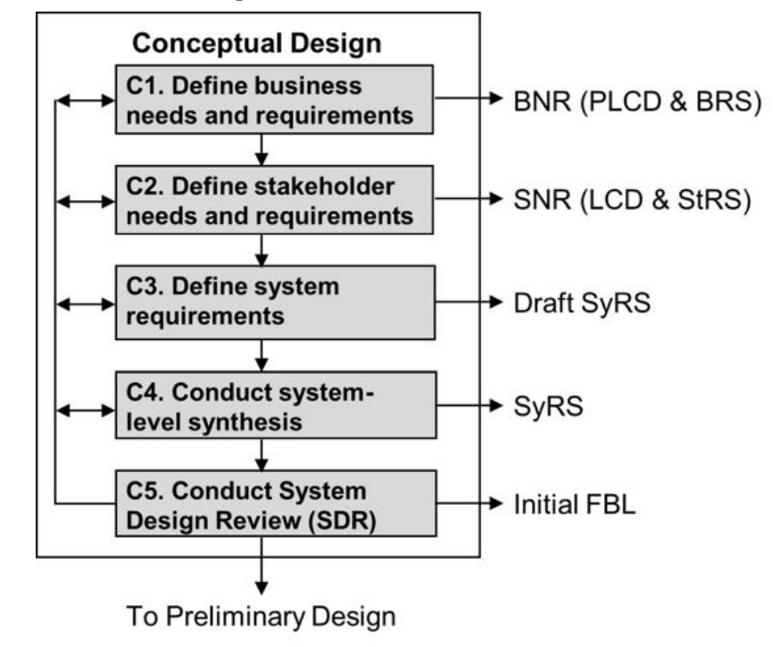
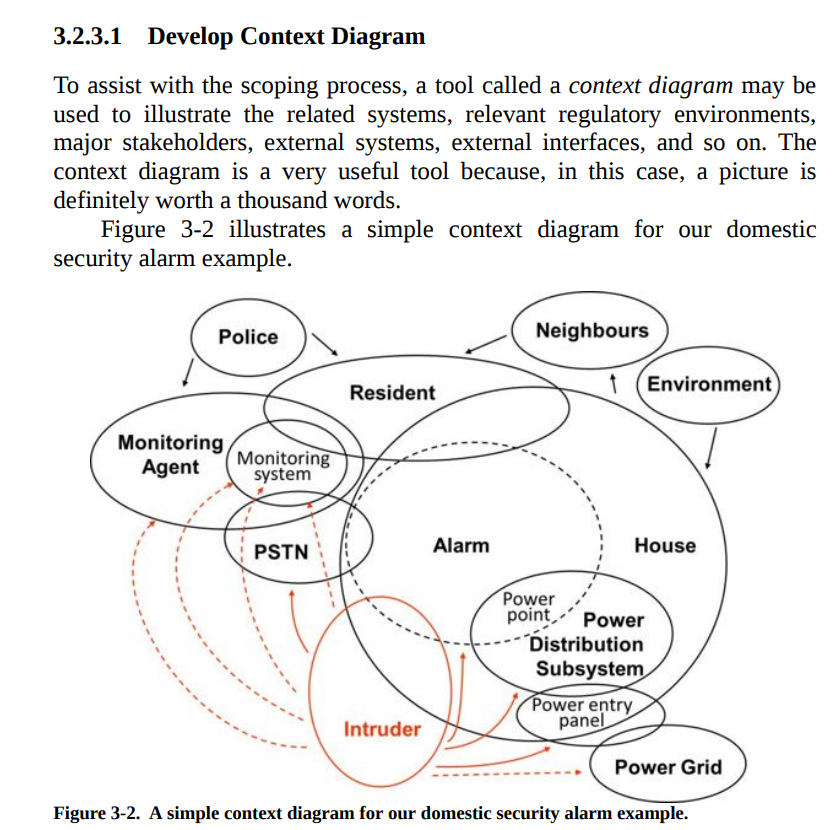
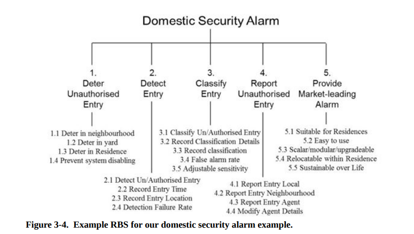

# Conceptual Design 概念设计阶段
概念设计的产物是FBL(the Initial Functional Baseline). 这个baseline提供一个系统层级的逻辑架构(logical architecture). 由于概念设计还在问题层(problem domain)，因此它与用户（客户）联系紧密（一切从用户开始）.

为什么我们说概念设计是产品设计生命周期的最重要的一个环节？
1. 概念设计对系统的定义有很大的影响。随着项目的推进，系统的定义会从简短的商业需求(business needs)发展到几百页的系统层级的逻辑需求，好的概念设计将帮助完成这一定义的拓展。
2. FBL将作为后续的延申的系统设计的traced back base.所以在前期尽量不要犯错！任何error都会在拓展过程(expansion)中被放大。
3. 概念设计将问题域联系到解决方法域（transition from the problem domain into the solution domain).也是customer(the acquirer)和developer达成的一个联系、平衡的重要过程。所以概念设计的产物--FBL就代表了Business&Stakeholder的Needs&Requirements.

下面我们讲一下如何进行概念设计：五个步骤，一张图。需要说明的是，五个步骤是Iterative(迭代)的，当然设计也是迭代的。

## C1 stage - Define business needs and requirements - BNR
在这一步，我们要做的工作是确定主要的Stakeholders和Constraints.需要注意的是，constraints和requirements总是联系在一起的。Constraints的类型有很多种，接下来会详细介绍。

### C1 - Who are the major stakeholders?
很多人在确定主要的利益相关者时会犯“列举”的错误，也就是将所有可能受到影响的人都假定是利益相关方。书中举了一个例子：
>银行所使用的ATM系统，运钞的安保人员算不算stakeholders?

尽管他们的requiremetents place considerable constraints on the design of the system, 但他们不会作为stakeholders被考虑。在类似的公共产品设计中，如果采用列举额的方法确定stakeholders，那几乎是无穷无尽的。
我们通常使用的确定原则是：一个stakeholders（组织或个人）必须有权利影响系统的输出(has a right to influence the outcome of the system)；而不是简单地以（可能会）受到系统影响来划分。

### C1 - What are the constraints?
限制、约束(constraints)是另外一种形式的需求。(Constraints are requirements that are imposed on the system in some way.)
对于约束的分析我们采用自顶向下的方式。
1. 商业约束(Business Constraints) - 包含管理指导、机构政策、机构标准、行业对于系统开发的指导准则。这一层面的约束主要是出于商业上的而非具体项目操作上的，涉及到公共关系、合同承包政策、人力资源情况、生命周期全流程考量(use of established life-cycle processes). 举一个例子，近期国内三大航空公司给空客下了：“世纪订单”。很多人问为什么不买国产的C919，理由是C919产能不足，且各个航司基本对空客、波音等老牌航空飞机manufacturer的飞机后勤保障体系建立得更好，短时间内无法为C919建立完善的后勤保障体系；而不买波音的理由就更简单了，政治对抗，这也是商业约束的一部分。
2. 项目约束(Project Constraints)一般指：预算限制、开发周期限制与技术标准限制。比如说，设计移动式房屋，需要满足一定的行业标准，安全性、移动性等等。
3. 外部约束(External Constraints) - 各国的法律法规、行业标准、道德风俗要求、此系统与其他系统进行交互的操作性要求、竞争对手的情况、市场上人力资源的情况、行业的特殊技能需求...一般来说，非具体项目操作的约束、不可控的约束，都是外部约束。
4. 设计约束(Design Constraints). 这个约束一般指辅助进行设计、开发、建造和生产的要素的约束。比方说新科技的引入、基础设施的升级与工人的技能提升。这些要素的特点是“直接地”与系统设计的实现与运转相关。

总体来说，进行约束分析时遵循的原则就是自上而下、由抽象到具体、从宏观到微观。其实没有必要严格地确定“什么什么是哪一类约束”，大致分类一下就可以了，有许多约束其实是重合在分类中地。

## C1 - 细致地确定Business Needs
确认了谁是stakeholders和存在什么constraints后，要考虑的事情就变成:确定利益相关方的考量(Elicit business intention)。
### C1 - 愿景、目的与目标 Mission，Goals, and Objectives
Mission（一般翻译为愿景）要求简短但能够覆盖方方面面的说明(succint but thorough). Mission要能够承担利益相关者的对项目的共识。
在得到一个drafted的mission statement以后，我们要做的是确定goals和objectives. 简单来说，Goals是相对宽泛一些的statements,对mission的延申，又继续延申(spawn)出更多的更细致的Objectives.在这样不断延伸、发展的过程中，我们要注意不要让新生的statements变得odd，也就是说，一切都要从旧的定义、认识中有源地发展出来，而不是凭空跳出来（要有记录的源头）。
Mission并不是一成不变的。Mission承载了business层级上我们对项目的认识、建设与期望，而当项目稳步发展时，我们会对这个项目本身及部署的环境、实际的形势有更深入的理解，这个时候我们要做好准备更新我们对mission的statement.
另外，一般来说我们的系统会面向广阔的社区(broader community of stakeholders)，我们在先期管理团队（小团体）讨论完mission, goals与objectives以后要将result拿出来和更大的相关群体讨论。我们最后要得到的有效的文件是*a formal set of statements that provide a complete, balanced description of the system, covering all aspects of operation, support and maintenance.（一份正式的、规范的说明，对系统及系统的操作、支持与维护有完善的阐述）*。之后的所有subsequent的requirements都要能够溯源(traceable)到这份文档。
### C1 - 定义先期验收标准 Define Preliminary Validation Criteria
书中对这一工作给了好的定义：
>Broadly, validation criteria encompass any mechanism by which the customer will measure satisfaction with the products of the Acquisition Phase.

翻译一下就是：用户对预期产品会有哪几个方面的期望？这些方面就是验收标准需要提前制定以进行设计验证的。
### C1- Preliminary Life Cycle - Preliminary Retirement Concept
Retirement的中文翻译是“退休”。当然，作为产品和服务来说，“退休”就是不再按照预定的计划继续使用。关于产品的“退休”，我们很好理解；而“服务的退休”，我想到的例子是：电话运营商XX服务下架了，怎么对消费者继续承担责任、怎么补偿消费者，或者是XX发廊倒闭了，怎么保障储蓄消费者的权益。
我们在Chapter2已经介绍过preliminary life cycle. 但是我们在这里仅再强调一下retirement concept. 由于是conceptual design stage，我们并没有真实投入生产使用的反馈。我们需要想象三个可能性：
1. 什么原因可能会导致retirement？ (identify the reasons for potential retirement)
2. 系统retirement的可能的方式、方法？(identify potential reirement methods for the system)
3. 这些方式、方法的设计问题？(design issues that may arise from the consideration of each retirement method)

## C1 - Scope System
"Scope"在中文中一般翻译成“范围”、“区限”。简单来说，这个系统就是描述目标系统所处的工况环境、与其他系统的联系。我们一般用一种工具来描述scope system——context diagram（工况图）。

系统边界的确定(Define System Boundary)——其实类似的工作在project management中也在做，称为“项目边界”(Project Scope).系统边界上一般是众多的interfaces。这些interfaces是横跨、联系本系统与外界的系统、环境与项目的(system of interest, external systems to which it is interconnected). 这些interfaces要精心设计，来完成系统的功能。

## C1 - Define Business Requirements
到达这一步前，我们已经在business mangement level确定了needs(requirements)并利用scope system对context和interconnection有了认识，我们再往后走就逐渐接近solution domain（解决方案域）。
这一步的主要工作就是transformation of those needs into formal requirements（将这些发现的需求转化为正式的、待执行的需要的工作）。

### C1 - Feasibility Analysis 可行性分析
在概念设计的阶段，我们要求所有的道德business management statement必须是logical terms（逻辑描述的）。这些逻辑描述的needs都是问题域(problem domain)的，在向解决方案域(solution domain)转变时，我们要意识到*each alternative solution class may represent a completely different type of project*（每一个可能的解决方案都代表着朝向一个完全不同的项目）。
Feasibility Analysis（可行性分析）的目标是*narrow down the solution domain so that the subsequent project can be managed effectively*，即缩小解决方案的可能（确定问题的解决方案）来让后续的项目管理变得有效。之所以要做这一步，是因为设计的广度是巨大的（这有点像双钻图的第二部分, the seond part of double diamond model）。
Feasiblity Analysis仍然是business management decision，还不涉及到stakeholders的商业执行层面(business operational level).

### C1 - Define Business Requirements - BRS
这一步主要是利用一个工具框架(framework)来生成一个层级性的(hierachical)结构。工具是**Requirements breakdown structure(RBS)**.

上图是一个家用的安全警报器的RBS.我们看一看最左侧的一个function(need)是对未经许可的闯入进行威慑、阻挠。在下一级结构中有四个solutions(requirements-待实现的需要)，分别是：
1. 在邻近的房屋进行威慑
2. 在庭院中进行威慑
3. 在房屋内进行威慑
4. 防止系统失效

我们可以看到，这个RBS记录了从一个need（威慑未经许可的闯入者）扩展到(decomposed, derived into)四个待实现的需要(requirements).根据我们先前的定义，这四个小点一起就能够完全地实现这个“威慑未经许可的闯入者”的need.
之后的StRS, SyRS就是从RBS继续扩展，最终到Physical domain，落实到用技术实现。