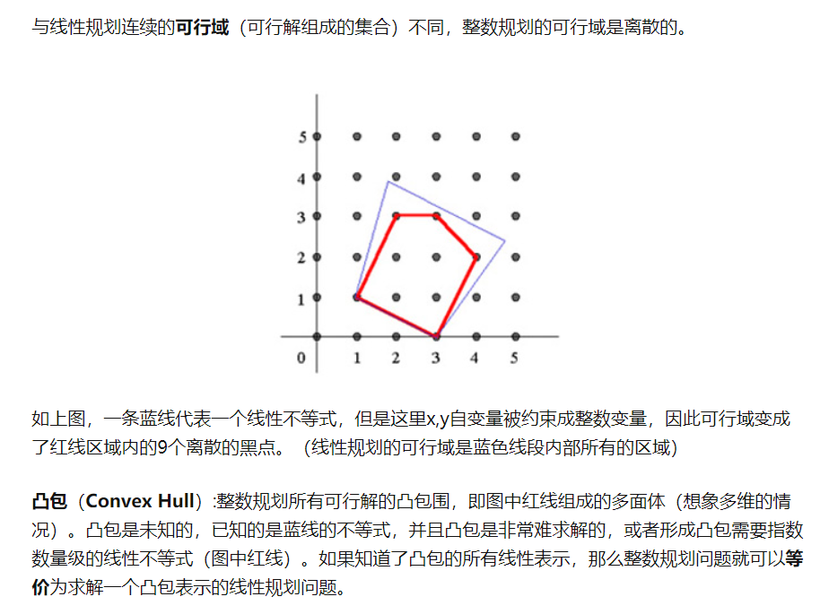
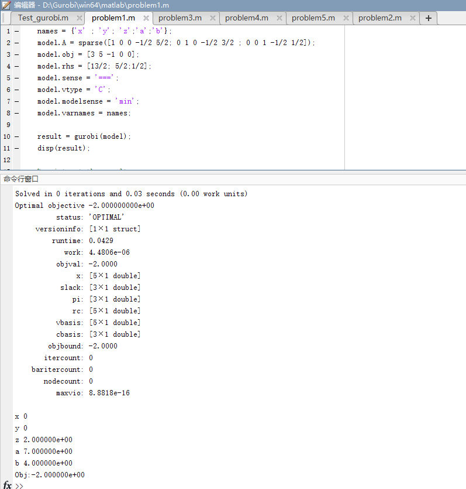
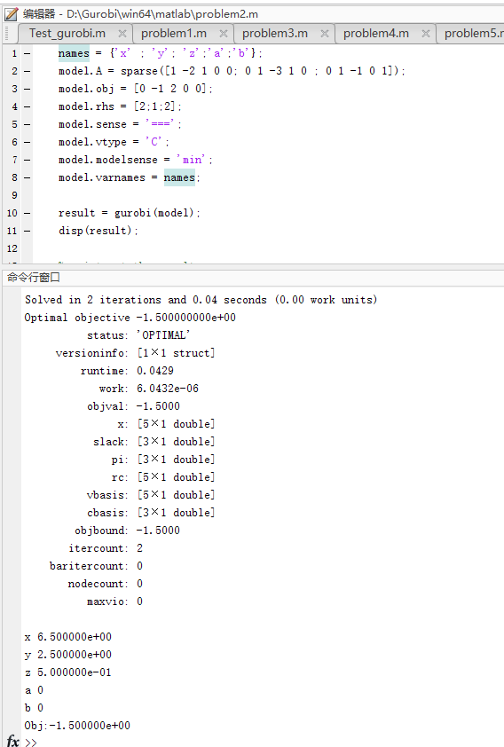
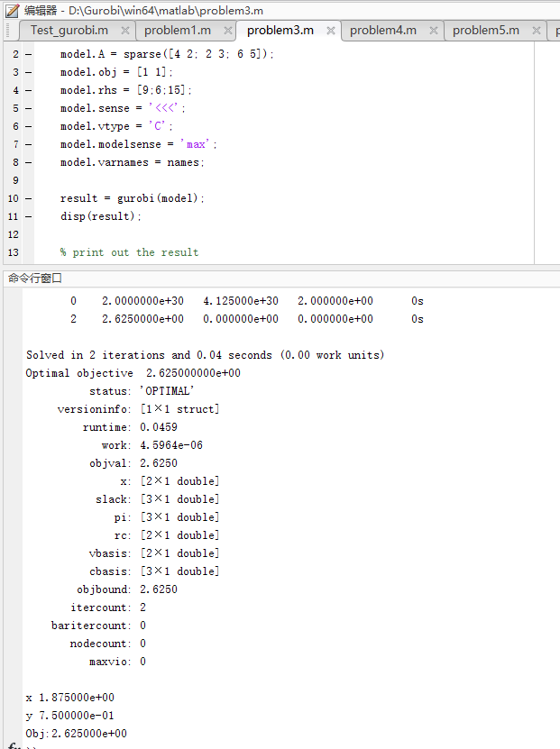
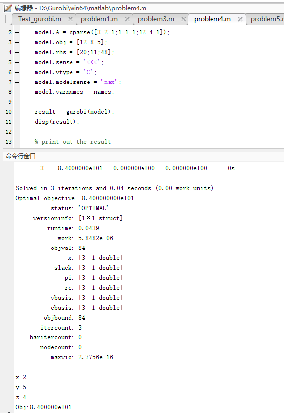
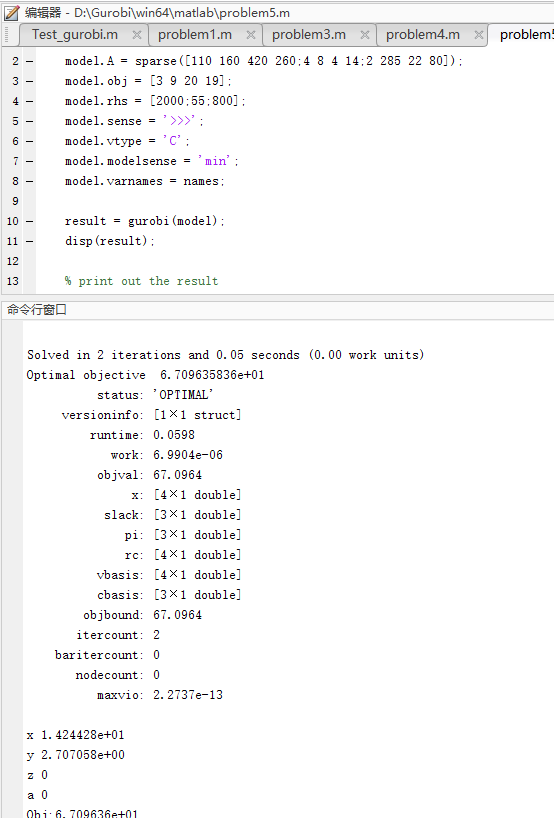

# Integer linear programming 整数优化
Programming 是运筹学的说法，Optimizing 是计算机、统计学那边的叫法。
求解整数优化问题(ILP)的两种基本办法是：
+ Cutting plane methods
+ Enumerative methods

无论是哪一种方法，基本的思路都是**reduce the number of solutions to be searched and eventually arrive at the optimal solution**

关于整数优化，我们可以首先讨论一下它的背景。整数由于其在数域上的离散特点，使得整数优化也被称作“离散优化”(Discrete Optimization). 优化问题我们会讨论可行域的定义.

这里要补充的知识是凸集与凸方程(Convex Set & Convex Function). 在之前的文档中曾简单介绍凸函数，更完整的介绍将会在看完教材后单开一章讲这个问题。
TODO: Convex def research

## Cutting Plane Methods 切割平面法
除课件与教材外，另一篇重要的参考引用资料出自知乎文章[“整数规划经典方法——割平面法(Cutting Plane Method)”](https://zhuanlan.zhihu.com/p/28387290)

**The gerneral intent of cutting plane methods for solving ILP**

Let's talk about the oldest cutting plane method, it has **several principles**:
+ A cut never excludes any integer solution from the new feasible region.
+ Each cut will reduce the feasible region of the original LP problem.
+ Each cut passes through at least one integer point.
+ In a finte number of steps, the ILP problem is solved(can be solved) as an LP problem.

## 整数规划的精确算法--分支定界法（Branch-and-Bound）
参考资料：[【学界】整数规划经典方法--割平面法（Cutting Plane Method）](https://zhuanlan.zhihu.com/p/27659600)

TODO:先交作业，补完有问题再问

### 上机作业

