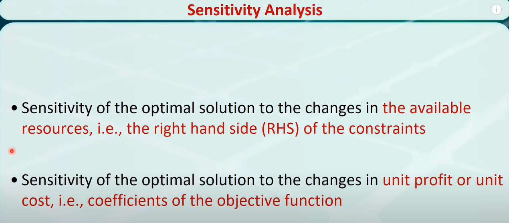

# 灵敏度分析与影子价格

本篇非王振坤教授课上内容。由于在IP问题的B&B方法中遇到一个对LP relaxation的**reoptimization process**解释以说明B&B过程中分支选择策略的比较，因此回顾（学习）一下 **the reoptimization technique** used in sensitivity analysis.

> 参考资料为Boyd经典著作以及[Yong Wang 的Video](https://youtu.be/oAPScEPsNqY).

## 灵敏度分析(Sensitivity Analysis / Post-optimality Analysis - POA)

### 对Objective Function作出改变时的灵敏度分析
这一种灵敏度分析的目的是：
>在什么范围内，我们可以改变LP问题OF中的coefficient parameter而不对optimal solution产生巨大的改变

  
上图是一个n=2即在2d space下的一个LP问题。根据图示，可以看到只要OF的slope在两个constraints所做出的约束之间，都不会对Optima产生影响。这是一个典型的POA问题，我们可以通过POA来确定最大利益（当某一部分发生改动时，确定整体利益是否会变化）比如下面的问题：
  

## 对可用资源作出改变时的灵敏度分析 - 即影子价格问题
这一种灵敏度分析的目的是：
>改变不同的约束条件（一般是以unit做）对optima会有什么样的不同影响

我们在做上一种POA时改变的是OF中的coefficient parameters，而在做影子价格时变化的换成了constraint. 一般来说constraint表示的是resource limit, 表示在RHS.
我们问：当constraint发生单位变化时(unit change)，optima会发生什么样的变化？ 
为什么我们要问这个问题：假设一个工厂有两条产线，各自有一定的约束；工厂想要升级产线，那么选取哪一条产线能够使得利益最大化？参考下面

图示的情况即为M1约束倘若能够单位增大，对optima的影响；同理，其他可调整的constraint同样有一个对optima的影响。通过Shadow Price影子价格（即未发生的代价/收益）来作出决定。

以上为Yong Wang的Video教学

---
以下为Introduction to Operations Research的4.7内容
TODO:22.5.14 - 后接Introduction to Operations Research 的4.7