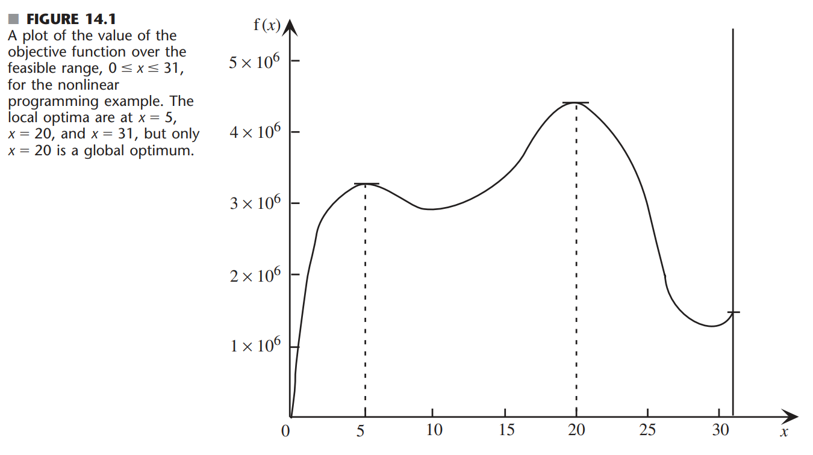
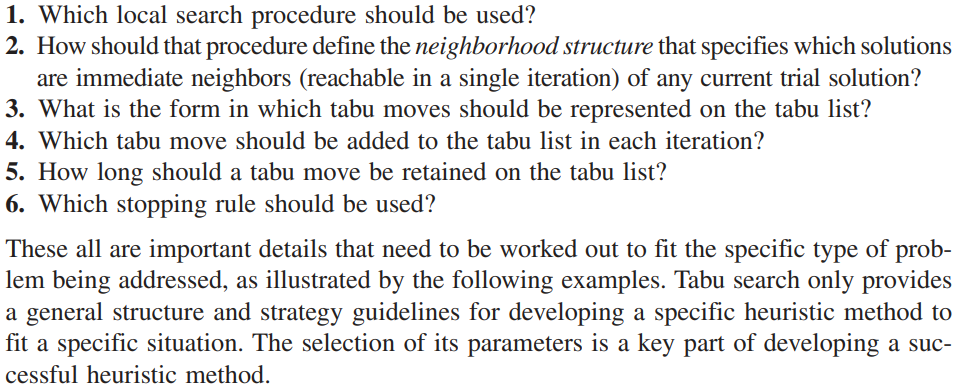
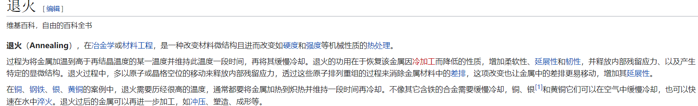

````
DOCTYPE - md & Katex. 使用基于Pandoc的渲染器输出PDF文档
Copyright is reserved by Harry Chen. If you have any problem, please contact the author through 11911421@mail.sustech.edu.cn
````

# Intro to Metaheuristics
> Reference : Boyed的Intro. Charpter 14.


### Def of heuristic method- 

A heuristic method is a procedure that is likely to discover a very good feasible solution but not necessarily an optimal solution(for the specific problem being considered)... can provide a silution that is at least nearly optimal(or conclude that no such solutions exist).

### The drawbacks of heuristic method- 

Heuristic method often are based on relatively simple common-sense ideas for how to search for a good solution.

*Comment: 比方说“仿生启发式算法”就是从自然界中的组织方式与行为方式得到“直觉的”灵感*

这些simple common-sense的ideas需要被carefully tailored来适应特定的问题。因此这些heuristics的方法 is designed to fit a specific problem type rather than a variety of applications.(启发式算法的针对性)

### Def of Meta-heuristics methods-

A metaheuristics is a general solution method that provides both a general structure and strategy guidelines for developing a specific heristic method to fit a paticular kind of problem.
简单来说就是：元启发式算法并不需要针对具体问题的情况设计特例的结构。元启发式算法式一大类问题的通解——基于启发式算法的特性，但是适用范围更广、约束更少。

### The nature of meta-heuristics
我们首先参考一个问题：

用一个简单的gradient search procedure做，假设从$x=0$开始作为inistial trial silution,那么会在$x=5$的时候停下来（因为达到了一个local optima.
或者以另一种方法 the bisection method 二分法来做，取 lower bound $x=0$ 和 upper bound $x=6$可以看到 sequence of trial solutions obtained 是 $x=3, x=4.5, x=4.825$即不断地逼近local optima $x=5$. 这是一个更加明显、典型的local improvement procedure.
TODO - 继续写，现在先跳到遗传算法的资料上

### Genetic Algorithm 遗传算法 GA

TODO - 参考资料：https://blog.csdn.net/acelit/article/details/78187715
TODO - 轮盘赌算法 参考资料：https://zhuanlan.zhihu.com/p/140418005 ,不过我更推荐这个[Youtube video](https://www.youtube.com/watch?v=-B15r-8WX48)

#### GA中的轮盘赌选择方法讲解 Roulette Wheel Selection for Genetic Algorithm
TODO - Roulette Wheel Selection for Genetic Algorithm

### Tabu search 禁忌搜索

我们之前了解过local improvement procedure,知道这一类的方法很有可能被困在局部最优解而无法得到全局最优解。GA解决跳出局部最优的方法是加入了mutation突变算子。而禁忌算法则在local improvement procedure的基础上加入了“非改进移动”的可能。
**“非改进移动”**的定义是：当不存在改进目标值的可行移动时，通过允许进行非改进的可行一栋来跳出局部最优解所在的区域，来避免重新开始进行改进搜索。这样的逆行移动可能可以把搜索引入到可以产生进一步改进的区域。

但是这样的策略存在一个**致命的缺陷**：以TSP问题中的一个local improvement procedure算法子环路反向算法(The Sub-Tour Reversal Algorithm)为例，倘若通过搜索得到一个局部最优解sequence,1-2-3-4-5;然后非改进移动发现1-2-3-5-4是略逊于最优解的次优解于是发生reversing（即非改进移动）；但是1-2-3-5-4序列又发现1-2-3-4-5是最优解，于是陷入了“局部最优-局部次优”的死循环中。

而**Tabu search**通过**暂时禁止移动到近期出现过的解**的这种方式来避免死循环并提高循环效率；最后的效果是**防止了短期循环**，但是很容易想到，解在长时间的搜索过程中还是会发生重复（Tabu List的长度是有限的，会执行删除溢出的操作）

做Tabu search，其实简单来说就是三个步骤
1. Initialization 开始条件是什么
2. Iteration 迭代过程
3. Stopping rule 结束搜索的条件
扩展上面的三个步骤，书中给出了Tabu search针对具体问题进行算法设计的关键细节：


教科书中讲到的几个例子都是**网络组合优化问题(Combinatorial optimization problems involving networks)**

### Simulated Annealing 模拟退火

<!-- 笑，梦回王教授做的材料工程基础，那时候我的pre就是讲金属高温加工过程。历历在目。 -->
