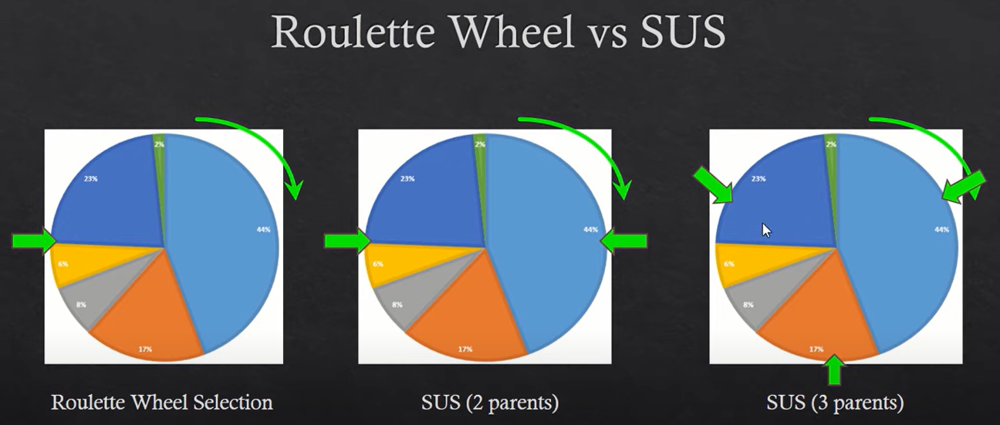
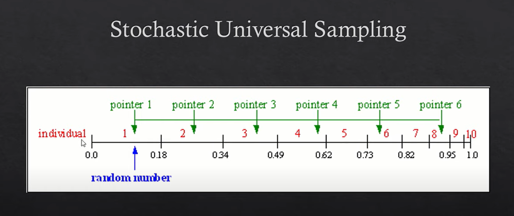

````
DOCTYPE - md & Katex. 使用基于Pandoc的渲染器输出PDF文档
Copyright is reserved by Harry Chen. If you have any problem, please contact the author through 11911421@mail.sustech.edu.cn
````

[toc]
# Intro to Metaheuristics
> Reference : 
> Boyed的Intro. Charpter 14.
> Optimization in Operations Research(2nd Edition) by Ronald L.Rardin 中文版译者肖勇波&梁湧
> 其他参考在文中给出


### Def of heuristic method- 

A heuristic method is a procedure that is likely to discover a very good feasible solution but not necessarily an optimal solution(for the specific problem being considered)... can provide a silution that is at least nearly optimal(or conclude that no such solutions exist).

## The drawbacks of heuristic method- 

Heuristic method often are based on relatively simple common-sense ideas for how to search for a good solution.

*Comment: 比方说“仿生启发式算法”就是从自然界中的组织方式与行为方式得到“直觉的”灵感*

这些simple common-sense的ideas需要被carefully tailored来适应特定的问题。因此这些heuristics的方法 is designed to fit a specific problem type rather than a variety of applications.(启发式算法的针对性)

## Def of Meta-heuristics methods-

A metaheuristics is a general solution method that provides both a general structure and strategy guidelines for developing a specific heristic method to fit a paticular kind of problem.
简单来说就是：元启发式算法并不需要针对具体问题的情况设计特例的结构。元启发式算法式一大类问题的通解——基于启发式算法的特性，但是适用范围更广、约束更少。

## The nature of meta-heuristics
我们首先参考一个问题：

用一个简单的gradient search procedure做，假设从$x=0$开始作为inistial trial silution,那么会在$x=5$的时候停下来（因为达到了一个local optima.
或者以另一种方法 the bisection method 二分法来做，取 lower bound $x=0$ 和 upper bound $x=6$可以看到 sequence of trial solutions obtained 是 $x=3, x=4.5, x=4.825$即不断地逼近local optima $x=5$. 这是一个更加明显、典型的local improvement procedure.
可以发现，这是一个“计算-探索”结构的问题：
1. 选择**计算**就会拿出更多的资源在某一局部寻找附近更优的解
2. 选择**探索**就会拿出更多的资源探索更远处的可能性以求避免提前在非最优局部收敛

**元启发式搜索方法**引入“随机”来达成**探索**.避免在早期搜索阶段陷入局部收敛陷阱。
# Genetic Algorithm 遗传算法 GA

遗传算法简单来说就是模拟自然界中生物种群进化的过程。我们回忆一下高中生物课本中关于种群进化的章节（有丝分裂）：
1. 亲代(parents)中优秀的个体更容易活下来
2. 在自然选择中活下来的更优秀的亲代随机配对，繁衍出子代(children).
3. 在亲代的基因传递给下一代的过程中发生小概率的突变(mutation)使得整个种群获得新的性状。新的性状既可能帮助子代更加适应环境，也可能让子代的竞争优势减弱。
4. 新一代种群继续繁衍...

遗传算法也称进化算法，就是模拟了种群进化的过程。相比于禁忌搜索和模拟退火在一个解上迭代(processing a single trial solution at a time)，进化算法以整个解集合进行优化迭代(work with an entire **polulation** of trial solutions).


需要说明在第一张图中*Individual living in that environment*不仅仅指current polulation中的解。为了引入多样性，在一些GA的设计中会加入**Immigrants 移民**作为亲代。这些移民是随机生成的可行解，一般来说会与当前种群特征无关。
需要注意上面第二张图示中的cross-over是单点交换。还有一种常见recombination的模式是多点交换。

总结一下进化算法的特点，即：
**A genetic algorithm tends to generate improving polulations of trial solutions as it proceeds.**
*注解：是”生存“的概率越来越高即更优，而不是种群数量更大。*

对于任何一个GA建模问题，有五个通用的需要回答的问题，这些问题也决定了这个GA算法的质量：
1. 种群大小应当是多大？
2. 如何决定当前种群中的哪些个体成为亲代？（以什么指标作为依据？）
3. 亲代的特征如何（经由哪种方式）遗传（传递）到子代？
4. 子代基因的突变如何（经由哪种方式）发生突变(mutation)?
5. 算法停止信号是什么？(Which stopping rule should be used?)

## Discussion on Parent Selection Mode 亲代选择模式的探讨
找到一个相当优秀的总结，可能比我下面的讲述还要清晰，可以选择浏览[他的分享](https://blog.csdn.net/hba646333407/article/details/103251008)。
+ 最简单的方式就是Random Selection, 这样current solution的所有解都有可能成为亲代解传递特征
+ Fitness-proportionate Selection (FPS) 也就是 Roulette Wheel Selection [轮盘赌方法](https://en.wikipedia.org/wiki/Fitness_proportionate_selection).简单来说，这个方法的核心想法是“存活几率越大，越容易被选为亲代，被选几率和存活几率直接相关联”。先计算出种群的存活率，"Usually a proportion of the wheel is assigned to each of the possible selections based on their fitness value...Then a random selection is made similiar to how the roulette wheel is rotated"
+ [Stochastic Universal Sampling (SUS)](https://en.wikipedia.org/wiki/Stochastic_universal_sampling) 随机总体*遍历）采样（选择）方法。这个方法比FPS更为常用，因为FPS的一个缺点是在取样时非平均，更有可能取得fitness极高的individual，这样的话weaker individual被取得的概率就几乎没有，使得它们的features（可能是好的features)不能保存在种群中。SUS的方法，简单来说，就是依照当前种群大小与目标子代数目确定步长，然后在第一步时进行随机。[有个印度老师讲得比较清楚。](https://youtu.be/n4YE0ROb8sw)


从图中可以直观地看出来：SUS在保留weaker individuals上做得更好，为解集合保存了多样性。
+ 锦标赛模式([Tournament Selection](https://en.wikipedia.org/wiki/Tournament_selection)). 

  + 锦标赛模式有一个重要指标称为*Selection Pressure*，简单理解就是个体的存活压力（压力都是同代给的，😀）.
  + 锦标赛的意思就是，每一次选择都随机得到一个规模为S的子集，然后选出子集中优秀的部分（选择的方法有很多）作为亲代。一般来说，S越大，Selection Pressure就越大（因为更容易包含high fitness的个体）
  + 锦标赛模式的优点在于：
      1.相比于FPS等方法，没有随机噪声(Stochastic noise) 
      2. 实现起来简单、高效
      3. 可以在并行架构上实现
      4. Selection Pressure可以通过调整Candidate size *S*快速调整
+ [截断方法Truncation Selection](https://en.wikipedia.org/wiki/Truncation_selection). 这个方法非常直观：截取current polulation的前1/p个体并复制p次获得亲代(p为大于1的整数)。这个方法使用频率比较低；在动植物育种领域是标准方法。
+ 概率选择Probability Selection，这个我也没搞太懂，只说是和FPS很像，但是不是用fitness作为选择指标。贴图：
  
  TODO - GA中的概率选择策略研究
+ 精英选择(Elite Selection):精英选择策略允许亲代中最优秀的部分原封不动地进入下一轮迭代。一方面，这样有利于传递亲代中已经明显出现的优势特征；另一方面，这一策略也使得GA有更大可能提前收敛到局部最优。
+ Reward-based Selection.

*由于进化算法能做的工作很有意思，所以决定继续往这个方向多看几篇文献研究一下。会单独开一节进化算法专题讲一下。参考资料暂定为 Introduction to Evolutionary Computing by A.E Eieben · J.E.Smith*

## GA中的轮盘赌选择方法讲解 Roulette Wheel Selection for Genetic Algorithm
由于轮盘赌方法比较常用且振坤课上讲到了，因此拿出来专门介绍一下。
轮盘赌(FPS) steps：
1. 计算当代(current population)的总和适应度(sum fitness).
2. 对当代的所有解(individual solution)进行排序
3. 对排序好的个解进行适应度累计概率计算(cumulative probability)
4. 随机指针位置

这个策略还是比较直观的
参考资料：
1. https://blog.csdn.net/acelit/article/details/78187715
2. https://zhuanlan.zhihu.com/p/140418005
3. 不过我更推荐这个[Youtube video](https://www.youtube.com/watch?v=-B15r-8WX48)

# Tabu search 禁忌搜索

我们之前了解过local improvement procedure,知道这一类的方法很有可能被困在局部最优解而无法得到全局最优解。GA解决跳出局部最优的方法是加入了mutation突变算子。而禁忌算法则在local improvement procedure的基础上加入了“非改进移动”的可能。
**“非改进移动”**的定义是：当不存在改进目标值的可行移动时，通过允许进行非改进的可行一栋来跳出局部最优解所在的区域，来避免重新开始进行改进搜索。这样的逆行移动可能可以把搜索引入到可以产生进一步改进的区域。

但是这样的策略存在一个**致命的缺陷**：以TSP问题中的一个local improvement procedure算法子环路反向算法(The Sub-Tour Reversal Algorithm)为例，倘若通过搜索得到一个局部最优解sequence,1-2-3-4-5;然后非改进移动发现1-2-3-5-4是略逊于最优解的次优解于是发生reversing（即非改进移动）；但是1-2-3-5-4序列又发现1-2-3-4-5是最优解，于是陷入了“局部最优-局部次优”的死循环中。

而**Tabu search**通过**暂时禁止移动到近期出现过的解**的这种方式来避免死循环并提高循环效率；最后的效果是**防止了短期循环**，但是很容易想到，解在长时间的搜索过程中还是会发生重复（Tabu List的长度是有限的，会执行删除溢出的操作）

做Tabu search，其实简单来说就是三个步骤
1. Initialization 开始条件是什么
2. Iteration 迭代过程
3. Stopping rule 结束搜索的条件
扩展上面的三个步骤，书中给出了Tabu search针对具体问题进行算法设计的关键细节：


教科书中讲到的几个例子都是**网络组合优化问题(Combinatorial optimization problems involving networks)**

# Simulated Annealing 模拟退火

<!-- 笑，梦回王教授做的材料工程基础，那时候我的pre就是讲金属高温加工过程。历历在目。 -->

**Definition of Simulated Annealing** - 
这一方法因其类似于金属冶炼中为提高金属强度而对其缓慢冷却的退火过程而得名。模拟退火算法通过依概率接受非改进移动的过程来控制循环。这一概率是由计算机随机生成的。

**为什么要设计这样的算法** - 
引用Boyed书中的原话：
>（The programming problem is like finding the tallest hill)...the search process gradully increase the emphasis on climbing upward by rejecting an incresing proportion of steps that go downward.

上面这句话是比较清晰的。书中还拿Tabu search的举（反）例：禁忌搜索的**drawback is that a lot of time(iterations) is spent climbing each hill encountered rather than searching for the tallest hill**.但在模拟退火中，"(the method) is to focus mainly on searching for the tallest hill"

我对这一段的注解比较简要，故抄出 - 
>That is - when time(iterations) goes by, the algorithum allows less and less 'downward path' trials, i.e., in the early stage, the algorithum is encouraged to explore more feasible region so as to meet the global optima (fortuitously).


上面是模拟退火算法的迭代示意
<!-- 上面的这个gif动态可能无法在PDF等输出格式下查看，如果需要查看，建议使用支持md的渲染器（阅读器），如有问题请联系11911421@mail.sustech.edu.cn 笑，如果是pdf查看也看不到这句注解吧-->

**核心操作**
1. 当移动集合$M$中存在当前解的可行邻域(Immediate neighbors of the current trial solution)时，随机选择可行移动$\Delta x\in M$记为临时移动$\Delta x^{t+1}$ 并计算净目标函数改进值$\varDelta obj$. 其为从当前解移动到下一可行解（临时解）目标函数的差值（注意该值可能为负值）
2. 如果$\varDelta obj$是正值，即$\Delta x^{t+1}$改进了目标函数，那么**必须接受移动**,并且对解进行更新$$\Delta x^{t+1}\leftarrow x^{\left (t\right)}+\Delta x^{\left(t+1\right)}$$
3. 如果如果$\varDelta obj\le0$，即$\Delta x^{t+1}$并不改进目标函数，那么以概率$e^{\varDelta obj/q}$接受该移动，并且对解进行更新$$\Delta x^{t+1}\leftarrow x^{\left (t\right)}+\Delta x^{\left(t+1\right)}$$
4. 如果解$x^{\left(t+1 \right)}$的目标函数值比现行解$\hat x$的目标函数值更好，那么替换$\hat x \leftarrow x^{\left(t+1\right)}$
5. 如果上一次温度变化后已经经过了足够次数的迭代，则降低温度q(温度影响了接受非改进移动的概率)

以上的步骤是退火算法的核心操作，略去讲解如初值选择、判断迭代条件等其他步骤. Step 4指出了模拟退火搜索于其他进行非改进移动的搜索一样**必须保持现行解$\hat{x}$迭代更新到目前为止能够找到的最佳可行解，并且当计算停止时输出$\hat{x}$作为近似最优解**.


关于模拟退火过程，附上两篇知乎文章：
[模拟退火算法详解](https://zhuanlan.zhihu.com/p/266874840)
[现代优化算法三部曲 | 模拟退火算法](https://zhuanlan.zhihu.com/p/266874840)

两篇文章都讲到一个Metropolis准则，其中[现代优化算法三部曲 | 模拟退火算法](https://zhuanlan.zhihu.com/p/266874840)中写到：
>模拟退火算法包含两个部分即Metropolis算法和退火过程。Metropolis算法就是如何在局部最优解的情况下让其跳出来，是退火的基础。1953年Metropolis提出重要性采样方法，即以概率来接受新状态，而不是使用完全确定的规则，称为Metropolis准则，计算量较低。

这里注意到一个新的名词——重要性采样方法。贴references:
[wikipedia-importance sampling](https://en.wikipedia.org/wiki/Importance_sampling)
[Zhihu - 重要性采样（Importance Sampling）](https://zhuanlan.zhihu.com/p/41217212)
[Zhihu - 重要性采样(Importance Sampling)详细学习笔记](https://zhuanlan.zhihu.com/p/342936969)
TODO - Reading references of importance sampling 重要性采样回补写
真的是没看懂...说明还有很多基础知识没有学！！