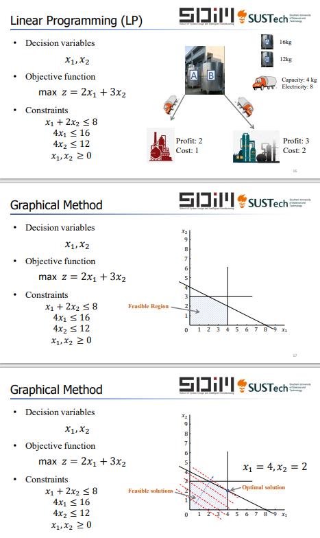
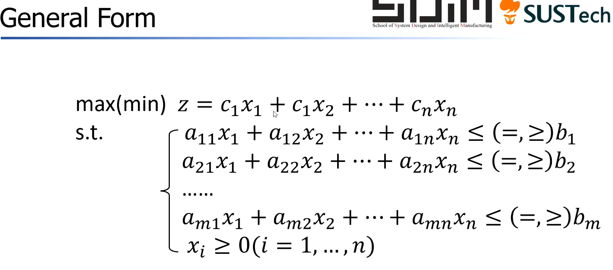
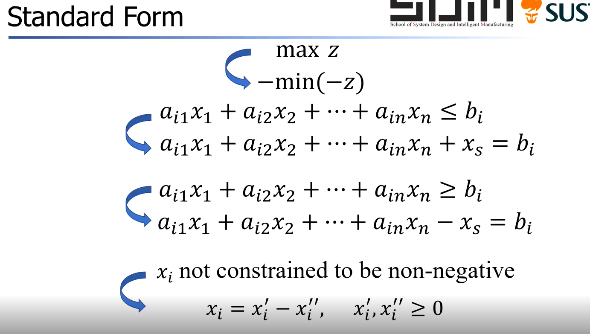
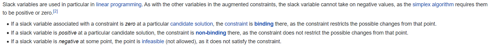

# 第九周系统设计与管理 运筹学介绍 (Introduction to OR)
````
DOCTYPE - md & Katex. 使用基于Pandoc的渲染器输出PDF文档
Copyright is reserved by Harry Chen. If you have any problem, please contact the author through ContactMeThroughMail@protonmail.com
````


《模仿游戏》、《美丽心灵》女主都好漂亮。

OR (Operational reseach) 运筹学的应用：
+ 生产计划 Product Planning
+ Facility location 生产设施选址
+ Job-Scheduling 工作分配（在计算机系统中的Job-Scheduling和OR有关吗？）
+ Logistic Transpotation 运输问题
+ [Bin-Packing](https://en.wikipedia.org/wiki/Bin_packing_problem) 容器容纳问题（做FPGA设计会用到）
+ Inventory Management 库存管理问题
+ Resource Allocation 资源分配问题（比如这一次上海疫情就可以用这个做）
+ Queuing 排序问题、排队问题
+ Portfolio 资产组合问题（是不是学了就能开始搞钱了）
+ Project Planning 项目规划问题

## 线性规划问题 LP - Linear Programming

    仓库中有A染料16KG，B染料12KG. A与B分别供应不同的工厂。
    运输车辆每次最大承载4KG. 运输车辆只有8单位动力。
    前往A的工厂需要1单位动力，每运去1KG A能获利2个单位；
    前往B的工厂需要2单位动力，每运去1KG B能获利3个单位。
    如何安排以获得最大利润(Maximum)?

  
<br>

线性规划问题我们一般用最大化或最小化来表示，有一般型(General Form):

还有一种称为标准型(Standard)，算法一般基于标准型开发。标准型的特点是：
+ 将最大化问题通过对偶转化到最小化
+ 将不等约束转化为等式约束


给出一个[参考视频](https://www.youtube.com/watch?v=4hp0mJgzmgc)（关于如何转化到标准型），并说补充上图的一些问题：
+ $x_s$ 称为[松弛变量](https://en.wikipedia.org/wiki/Slack_variable)，松弛变量称为(Slack varaible)，通过加入一个松弛变量，我们把不等式问题简化成一个等式问题，[参考这一知乎回答](https://www.zhihu.com/question/308189306/answer/1172147714)。我们需要$x_s$是非负的（单纯形法需要它满足非负才成立）
+ Binding的定义 
  + A contraint is **binding** if the left hand side and the right hand side of the constraints are equal at the optimal solution.
  + Otherwise, it's not binding.

再给出一个[参考视频](https://youtu.be/f3Gz4SGQV9M)，这个讲得更好。这个华人教授讲得很清楚，最重要的是英语口音没有咖喱味...

但是这里似乎有一个定义的不同 **@王振坤教授**，似乎在一些地方会有slack variable 和 excess variable 的区别：参考  

## Linear Programming 中的 Dual Programming 

对于对偶规划问题(Dual Programming)，参考了一个美女姐姐的教学视频（小姐姐声音好甜）

### 第一节视频：https://youtu.be/yU8updOR87c
考虑下面这个General form的**最大化**LP问题：
$$
    \begin{align}
    Z = 3x_1 + 4x_2\\
    \frac{1}{2}x_1+2x_2\leq30\\
    3x_1+x_2\leq25\\
    x_1,x_2\ge0
    \end{align}
$$

我们会发现对于(2)有 $$6\times\left [\frac{1}{2}x_1+2x_2\leq30 \right ]$$ 即$3x_1+12x_2\le180$，又由于(4)的成立，有$$Z=3x_1 + 4x_2\le3x_1+12x_2\le180$$
那么同样的我们可以得到
$$4\times\left[ 3x_1+x_2\leq25\right]$$ 
$$\Downarrow$$ 
$$Z=3x_1 + 4x_2\le12x_1+4x_2\le100$$
我们只是对(1)或(2)式作单独的乘数操作，我们也可以联立两式来达到：

$$2\times\left[\frac{1}{2}x_1+2x_2\le30\right]+\left[3x_1+x_2\le25\right]$$ 
$$\Downarrow$$ 
$$Z = 4x_1+5x_2\le85$$

Dual programming的想法就是这样——通过找到Maximum LP问题中等号右边的最小值，来确定Maximum value到底是多少。那我们要问，是否存在这样一种形式可以“恰好地”得到解：
$$y_1\left[\frac{1}{2}x_1+2x_2\le30\right]+y_2\left[3x_1+x_2\le25\right]$$
从而得到：
$$\left(\frac{1}{2}y_1+3y_2\right)x_1+\left(2y_1+y_2\right)x_2\le30y_1+25y_2$$
这里出现了一个重要的性质：如果我们希望以上不等式成立，就必须确保$30y_1+25y_2$总是大于左侧部分；注意到我们在前提中使用了“恰好”这样的词，说明我们希望右侧部分和左侧部分“尽可能恰好地”相等。  
注意到Objective Function是 $Z = 3x_1+4x_2$，我们只要达成如下条件便可以保证: 
$Z = 3x_1+4x_2\le\left(\frac{1}{2}y_1+3y_2\right)x_1+\left(2y_1+y_2\right)x_2\le30y_1+25y_2$
条件是：
$$
\begin{cases}
 \frac{1}{2}y_1+3y_2 \ge3\\
2y_1+y_2 \ge 4 \\
\end{cases}
$$
从而我们发现了一个不得了的事情：我们似乎可以从一个Max的LP问题找到一个Min的LP问题，这样就称为Dual Programming. 上面的这个例子最终的Dual Programmming LP是：
$$
\begin{align}
W = 20y_1+25y_2\\
 \frac{1}{2}y_1+3y_2 \ge3\\
2y_1+y_2 \ge 4 \\
x_1,x_2\ge0
\end{align}
$$
**我们使用W表示Dual programming的目标函数，用Z表示Primal的目标函数**
简单总结一下Dual programming的思想——找到Objective Function能够逐渐逼近的的Upper bound/ Lower bound.  
下面我们来考察一下Dual Programming的性质(Properties)：

1. Weak duality property
   + 在一个Max LP问题中，Primal问题的可行解总是被bounded from above by 对偶问题的可行解；Min LP 问题则是bounded from below.
   + 数学表示 $ Max\Rightarrow\bar Z\le\bar W$
   + 数学表示$ Min\Rightarrow\bar Z\ge\bar W$
2. Unboundness property
   + If the primal (or dual) problem has a unbounded solution, then the dual (primal) is infeasible.
   + 这个性质很好理解，可以从 Weak duality property得出
   + 数学表示（Min省略） $ Max \Rightarrow \bar Z\le\infty$
3. Strong duality property
     + If the primal (dual) problem has a finite optimal solution （有限取值的最优的解）, then so does the dual (primal) problem and the values of primal and dual objective function are equal at their optimal solution.
     + 数学表示  $Z\ast =W\ast $

### 第二节视频 https://youtu.be/MWwnk9XIQ0Q
TO-DO ：LP2
### 第三节视频 https://youtu.be/wVnr1HhUCT0
TO-DO: LP3
