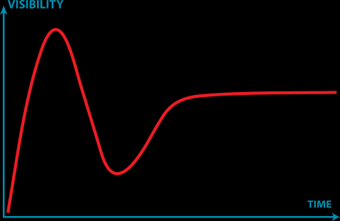
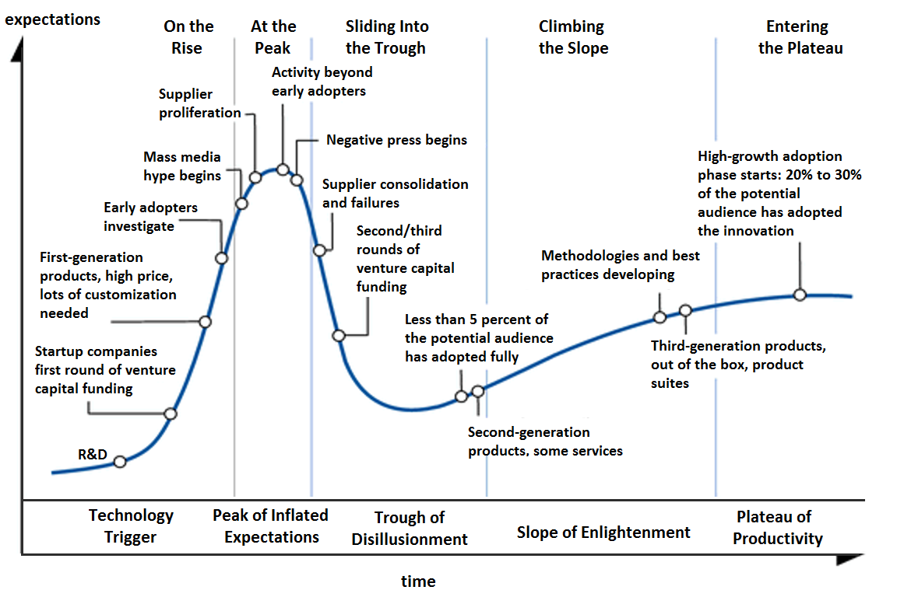

# 2022年5月2日 - Keyword: 技术生命周期、区块链技术、加密货币、金融、舆情、方向选择

## 什么是加德纳技术生命周期曲线 [Gartner hype cycle](https://en.wikipedia.org/wiki/Gartner_hype_cycle) ?

  
  

这是一件很有意思的事情，今天我们学习的东西、追捧的东西其实都处在Peak of inflated expectation附近。
王振坤做的运筹学是一百年前就开始做的东西，今天早就out of date了。但是SDIM所追求的“学科交叉、学科融合”却越来越像不断地追逐peak.
一般来说，我们应该做 Techonology trigger那里的东西，但是很显然地——九死一生，没有人知道哪一个新技术能活下来。今天大众能够看到的什么人工智能、深度学习，其实都是prolferation之后的膨胀的产业，倘若你在大学本科打定主意做这个工作，那等到你去找occupation的时候就完蛋了！这个技术、这个行业就到disillusionment的阶段了！

所以今天大家在卷AI，大部分人就是在找罪受、找死！这个东西只有头部的人才能稳定，那么多人做的都是跟风的东西、模仿的东西。做个P！看着吧，再过一年、两年，做AI的人会更难受！

参考资料：
+ https://www.youtube.com/watch?v=l6wzydHQQ_M&list=PLqybz7NWybwUnIIw0THjTnsXoE8m-lgiI&index=1&t=1s

## 最近我的工作 RECENT WORK

最近的工作是做做设计，主要是产品的概念设计，当然也有一些自己喜欢的工作：平面设计。
然后系统设计那门课要做一个网站，我主要是做后端的，和php, Apache, SQL 打交道。队友不太会写代码，整个工作比较混乱，我有点不太想干（和去年又不太一样了，去年做机器人小车是有一些东西我没学的、不会做的，比如说机械；但是今年的工作基本都是写代码，其实我一个人也能干完全流程）。团队协作的效率很低，但是没有办法，大家都是朋友、同学，我也不好说什么怕打击人。  
既然做了网页的开发，那不如就自己再深入学一学搭建一个网站。最近有点想开计算机网络的学习模块——以前开过，但是时间不宽裕就停了。准备选购一个海外的云服务器动手做一下practice. 主要的支出是**学习时间、项目实现时间**和大约1000元以下的云服务器、机场购买费用。

最近很多朋友劝我：不要什么都想学。我认真思考了这个问题，他们的确是对的。包括我自己，也早已经意识到这是一个严重的问题！一方面，我对自己的智力有着充足的信心，但是时间并不站在人类的一边；另一方面，经济形势、社会环境正在快速地恶化，我必须更快地确定将来做的方向，快速发论文、做出成绩来尽早地完成社会资源的交割。

设计工作将来不会做，太过于理想，并且并不能改变很多东西。机械、材料学科则更不能做（工程材料或可考虑，但材料工作的问题是基础学科的封闭性）。
电子和计算机的成熟部分不能做，那是去养老的、卷的。可以做一些成熟的工作来学习基础知识，但是必须要往前走，走到研究的、应用的最前沿去！

必须精简！必须集中精力！必须像国家的五年计划一样制定强力的、规范的、约束的建设计划!

这一次的计划已经有了前期的调研，发现对于计划的执行相较于三年前已经有了一定的松懈，由简入奢易、由奢入简难！这一次可能需要额外设立的监督者的帮助。这一次的计划命名为“721工程”，以纪念国家在动荡年代进行的航天事业，圆科学先哲们的未竟梦想。

## 加密货币、区块链、金融

这一块集中讨论。
在Gartner曲线上，这个方向大约在复苏期 Enligntment的前夕。从18-19年概念炒热之后的缓缓回落来看，Gartner Curve在这个领域基本是成立的。
从哲学意义上来看，去中心化的思想一反几千年来人们对社会结构的认识，我想能够做出很多有意思的工作。
继续研究，补足数学基础（密码学等）。

参考阅读：
+ https://www2.deloitte.com/cn/zh/pages/innovation/articles/blockchain-in-financial-industry.html
+ https://lbry.tech/spec?_ga=2.22533115.1730956739.1651474817-699957876.1651474817
+ https://antchain.antgroup.com/about

## 舆情

最近的世界不太平，准确来说，中国正在一个有些尴尬的处境上。用“外忧内患”形容可能也不为过。一方面，世界范围内，“共存”派基本挺过了大规模爆发的阶段，群众对疫情麻木，大家对疫情的危害性基本冷淡了，认为它不过是一个大号的流感；另一方面，中国还在坚持“清零”政策，无论是“动态清零”还是最近提出的“社会面清零”，其实都是原有的严格清零对经济、生活影响太大了，而采取的折中手段。  
制造业压力很大，大家的口袋里都没钱了，国家财政也没钱了，所有人的压力都很大。  
世界正在比烂，大家都在抨击：在心里，从口周，在网上。但是因新冠离开这个世界的人，只能从彼岸遥望着我们这一方刻薄的世界，他们的声音再不可能为我们所听见了。什么是真正的“人民利益至上”？中央的决策是对的，我们现在只能咬紧牙关，从各地支援疫情爆发的地区，支持最新型疫苗的研发。  

当所有人都因为这该死的疫情而疯狂、尖叫、被言论裹挟着失掉平日的理智时，有着坚定信仰的人应当攥紧拳头。我们并不站在某一地区的某一部分人那边，我们站在全国各族人民那边，换句话说，我们必须站到广大的人民群众那边————英雄的中国人民总会理解我们当下的处境！我们要保障一种权利————与亲人、朋友一起生活的权利。

## 方向选择

我们要选择什么样的方向？无论答案是什么，总是要记住————坚持自己的道路不动摇。