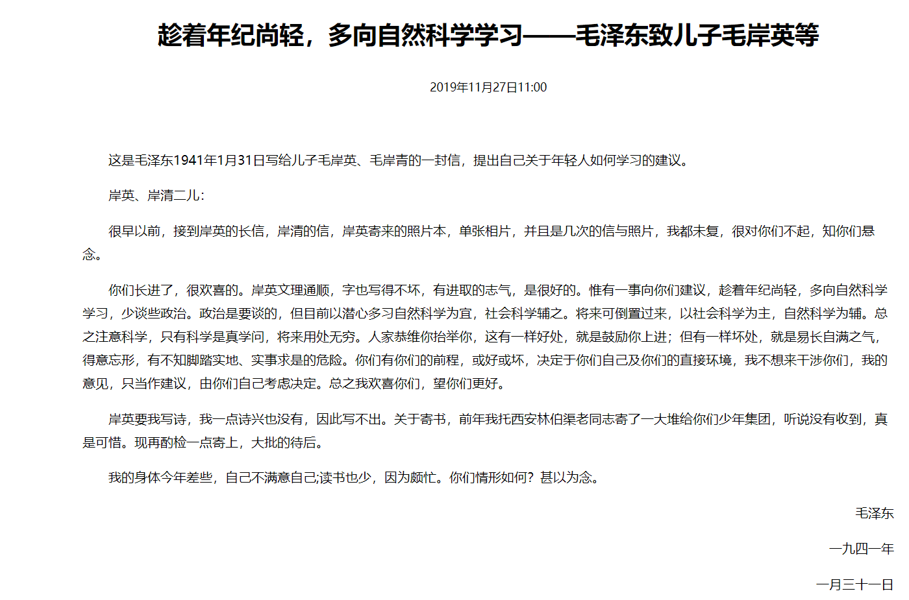

# 政治生活的反思————以及对加紧学习自然科学的决心

疫情以来国内的政治舆论几番轮转。疫情拖得越久，人民的生活便越受到影响；尤其是眼下疫情仍然反复，痊愈的日子还远未到来。  
一直以来，我都十分愿意观察网络舆情。
现在已经算是乱世，各种声音都有，但凡一些风吹草动，所有人的神经都绷紧起来。

我并不是政治学或经济学以及其他社会学科出身的人。因此目睹问题暴露出来时，我受到了巨大的冲击————我想许多人，尤其是十几、二十几岁的青年人，和我一样。即便是社会学科出身的年青人，又能够把持几分定力呢？！尤其是今天的许多大学，并不以传授知识、启发民智为目的存在，而是变成一个文凭印刷厂了！能有多少人可以在风雨飘摇的年代对国家的境遇、时代的责任、个人的命运有严肃的反思呢！  

我渐渐察觉到：我并不成熟、并不“强大”。过往我所追求的——独立的、自主的、强力的，都是浮光掠影。
我并不是一个成熟的人。从某种意义上来说，我只是有可能比“他人”在将来更早地“成熟”；可那又有什么用呢？！

我至今已经明白——“潜龙勿用”之意若何，过去两年我忠实地执行了前辈们给我的建议，我想也是时候进入一个新的阶段了。
年轻的人并不有足够的阅历以产出深刻的思想；年老的人却并不有足够的精力以实现变革的意愿。
我期盼着...我必须谨慎，至少从今以后的大段时间，我不愿再谈论政治。如果你问我大概是多久，我想是二十年。

毛在1941年与儿子的书信，或许可以引以参考。
  

自然学科最好在年轻时学——求知欲，满身的力气，用不尽的想象力。飞去，就让时间飞去，在无边无际的知识里，在收藏者过去到如今的所有人类智慧的图书馆里，拥抱纯粹的安宁。

22.5.14