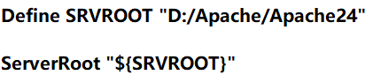

# Apache 安装 & 解析PHP

## Apache 的安装过程 - Environment Windows 10
需要说明的是，Apache的实际生产过程主要在Linux平台上；在Windows上使用Apache一般也是在虚拟机Linux系统下

*安装Apache*
1. 访问Apache HTTP Server official website
2. 找到栏目 Downloads
3. **注意**该页面上的版本都是Linux下版本；请勿点击下载。阅读页面，找到关于Windows下Apache安装的说明，进入给出的第三方安装文件提供者的超链接
4. 下载第三方（推荐排名前两个的常用的提供方）提供的软件二进制文件并解压到自己想要存放软件的文件夹，注意不要有中文和特殊符号（比如说&）.

*配置Apache*
1. 修改Apache的ServerRoot参数：找到Apache24 folder也就是文件解压到的文件夹，其中会有一个conf folder，'conf' 其实就是['ini'](https://zh.wikipedia.org/wiki/INI%E6%96%87%E4%BB%B6)。conf 文件夹中都是初始配置文件（恰如其名）
2. conf folder下找到一个名称为httpd.conf的文件。httpd其实是一个abbr.([HyperText Transfer Protocol daemon](https://en.wikipedia.org/wiki/Httpd))。使用记事本打开它（随便用什么文本编辑器都可以）
3. 使用Crtl+F打开寻找“Find”功能. 找到ServerRoot设置并修改为你的电脑中Apache24文件夹的绝对路径
   只需要改SRVROOT后引号中部分即可，下一行其实是一个对上一行路径的引用不能修改.
4. win+r并键入cmd打开控制台（如果后续出现问题，试一试以管理员身份打开控制台）并进入Apache24下的bin文件夹（软件本体基本在这个文件夹中）
5. 键入 **httpd -k install**(注解：不要带*、""等符号)；如果控制台返回一个有关软件已经安装过的error或warning，则键入**httpd -k uninstall**(注解：不要带*、""等符号)并再次执行本步骤.
6. 完成上述步骤以后进入检查部署环节：在控制台中（在bin文件夹下）键入指令**httpd -k start**(注解：不要带*、""等符号).一般不会有反馈.打开浏览器，在url输入栏中键入**http://localhost**(注解：不要带*、""等符号).浏览器会渲染出一个介绍Apache的界面或者显示如"It works"的成功提示字符（根据你选定的第三方提供商而有不同）。如果你用这个方法出现了问题，也可以使用其他方法。
   + 双击运行解压目录/bin下的ApacheMonitor.exe，然后会有一个右下角的后台程序，双击它打开面板，start启动（如果start不可选择且面板左侧没有显示任何apache版本则说明 step5 没有正常完成. 正常情况应该如下图：
   + 或者手动在windows中打开服务。win+r键入**services.msc**(注解：不要带*、""等符号)找到名称为Apache的服务后启动。如果没有找到该服务，返回 Step5.

*配置Apache（提供PHP支持）*
1. 到官网上下载PHP，**注意**找到Windows版本，而不是去下载suffix为gz的压缩包；并解压到你希望储存PHP软件的文件夹
2. 打开Apache24 folder也就是Apache文件解压到的文件夹，再次编辑conf folder中的httpd.conf. 为了保持工整，我们crtl+F找到LoadModule（有一长串）的结尾，并粘贴如下文本：
      ````
      # 在 PHP 8.0.0 之前，模块的名称是 php7_module
      LoadModule php_module "D:/PHP/php8apache2_4.dll"
      <FilesMatch \.php$>
          SetHandler application/x-httpd-php
      </FilesMatch>
      # 配置 php.ini 或 php.ini-development的路径
      PHPIniDir "D:/PHP"
      ````
   + **注意** 如果你的PHP版本是PHP7，那么 LoadModule php_module "D:/PHP/php8apache2_4.dll" 中的php_module请替换成php7_module.
   + **注意** 请将"D:/PHP/php8apache2_4.dll"替换成你的PHP安装文件夹下的php8apache2_4.dll的绝对路径
   + **注意** 请将 PHPIniDir "D:/PHP"中的"D:/PHP"替换成你的电脑中PHP软件存放文件夹的绝对路径
3. 

