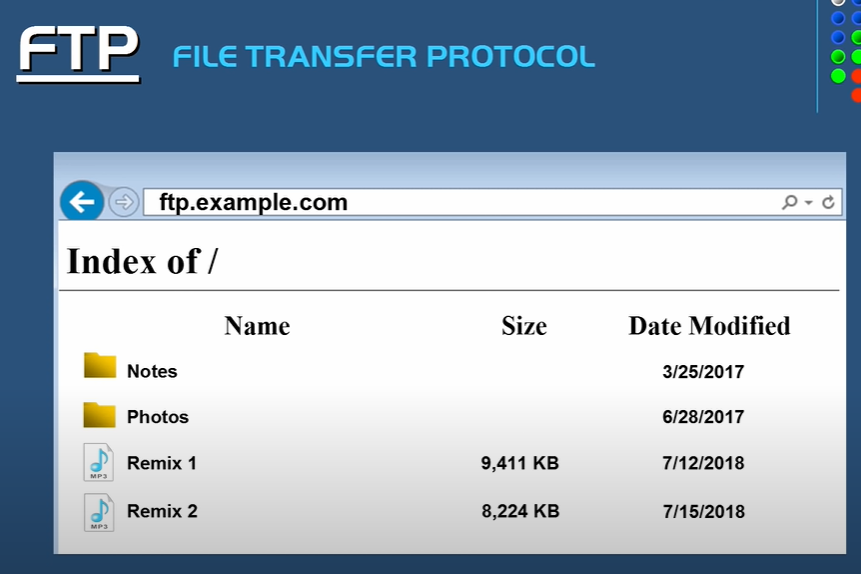

# FTP是什么？ 
> 参考视频： [FTP (File Transfer Protocol), SFTP, TFTP Explained.](https://youtu.be/tOj8MSEIbfA)

**FTP** stands for **File Transfer Protocol**

To use FTP protocol, you can use net browser or a FTP client.

## Use net browser for a FTP server
Normally, we would use "http" as a prefix but when using FTP, we use "FTP" prefix instead.

## Use FTP client for a FTP server
It's convinient to use a FTP client instead of net browser for better GUI.
It's very common for a web designer using FTP client to transfer files into the server.

## FTP is not a secure protocol
FTP tranports files without encypted them.

## FTP 加强版 

SFTP stands for **Secure(or SSH) File Transfer Protocol**
*Note* - Either FTP or SFTP are connection oriented protocols. They both use TCP for file transfer, i.e. they are delivery-guranteed.
*Note* - 我们说SFTP是FTP的“加强版”可能有无，事实上，SFTP是SSH的extension，尽管传输文件的purpose都是一样的（让传输变得更安全），但是SFTP和之后的FTPS不一样；有另外一种协议是FTP的extension称为FTPS(FTP Secure or FTP SSL)，支持FTP使用TLS和SSL的encyption.

## TFTP - Trivial File Transfer Protocol
Unlike FTP or SFTP, TFTP is a connectionless protocol. It uses UDP instead of TCP, i.e. TFTP would not gurantee the completeness of transferred files. 
TFTP is used in LAN(local area network), so it does not (need to) provide any security during data transfer.
TFTP更像是FTP的超级简化版——要求快速、小巧、便捷，当然也牺牲了其他特性。

# Further details of FTP 
>参考视频 [FTP-explained by CertBros in Youtube](https://youtu.be/L9aZpg0ip70)
1. FTP normally uses **passive connection** rather than **positive connection**. It means that under the client-server model, if the server side initially sent a connection-build-request, the firework of the client side would proboblaly reject it(default setting). To avoid this situation, the client side, normally, is asking connection-build-request first.
2.  